# TCGAplot (v8.0.0) #

#### (DO NOT INSTALL USING "devtools", PLEASE download the .zip file and install the package locally)

**author:** Xiong Wang

**email:** [wangxiong@tjh.tjmu.edu.cn]() or wangxiong@hust.edu.cn

**affiliation:** Department of Laboratory Medicine, Tongji Hospital, Tongji Medical College, Huazhong
University of Science and Technology, Wuhan 430030, China.


# 1. Introduction

Pan-cancer analysis aimed to examine the commonalities and heterogeneity among the genomic and cellular alterations across diverse types of tumors. Pan-cancer analysis of gene expression, tumor mutational burden (TMB), microsatellite instability (MSI), and tumor immune microenvironment (TIME) became available based on the exome, transcriptome, and DNA methylome data from TCGA. Some online tools provided user-friendly analysis of gene and protein expression, mutation, methylation, and survival for TCGA data, such as GEPIA 2 (<http://gepia2.cancer-pku.cn/#index>), cBioPortal (<http://www.cbioportal.org/>), UALCAN (<https://ualcan.path.uab.edu/index.html>), and MethSurv (<https://biit.cs.ut.ee/methsurv/>). However, these online tools were either uni-functional or not able to perform analysis of user-defined functions. Therefore, TCGA pan-cancer multi-omics data were integrated and included in this package, including gene expression TPM (transcripts per million) matrix, TMB, MSI, immune cell ratio, immune score, promoter methylation, and clinical information. A number of functions were generated to perform pan-cancer paired/unpaired differential gene expression analysis, pan-cancer correlation analysis between gene expression and TMB, MSI, immune cell ratio, immune score,immune stimulator,immune inhibitor, and promoter methylation. Methods for visualization were provided, including paired/unpaired boxplot, survival plot, ROC curve, heatmap, scatter, radar chart, and forest plot,in order to easily perform integrative pan-cancer multi-omics analysis. Finally, these built-in data could be extracted and analyzed with user-defined functions, making the pan-cancer analysis much more convenient.

# 2. Installation
## 2.1 For Windows system
To install this package for Windows system, download TCGAplot R package at [https://github.com/tjhwangxiong/TCGAplot/releases/download/v8.0.0/TCGAplot_8.0.0.zip](https://github.com/tjhwangxiong/TCGAplot/releases/download/v8.0.0/TCGAplot_8.0.0.zip) </br>

and install locally.


</br>

There were several dependent R packages, and users could install these dependent R packages using the following codes before the installation of TCGAplot.

```r
if(!require("BiocManager")) install.packages("BiocManager",update = F,ask = F)

cran_packages=c("magrittr",
                "dplyr",
                "tibble",
                "ggpubr",
                "stringr",
                "reshape2",
                "psych",
                "limma",
                "circlize",
                "grid",
                "fmsb",
                "survival",
                "survminer",
                "forestplot",
                "pROC",
                "tinyarray",
                "ggplot2",
                "patchwork",
                "ggsci",
                "RColorBrewer",
                "pheatmap")

Biocductor_packages=c("edgeR",
                      "org.Hs.eg.db",
                      "clusterProfiler",
                      "enrichplot",
                      "ComplexHeatmap",
                      "GSVA")

# install packages in CRAN
for (pkg in cran_packages){
  if (!require(pkg,character.only=T)){
    install.packages(pkg,ask = F,update = F)
    require(pkg,character.only=T) 
  }
}

# install packages in Biocductor
for (pkg in Biocductor_packages){
  if (!require(pkg,character.only=T)) {
    BiocManager::install(pkg,ask = F,update = F)
    require(pkg,character.only=T) 
  }
}
```


# 3. Pan-cancer analysis

## 3.1 Pan-cancer expression analysis

### 3.1.1 Pan-cancer tumor-normal boxplot

#### `pan_boxplot`

Create a pan-cancer box plot for a single gene with symbols indicating statistical significance.


```r
pan_boxplot(gene,palette="jco",legend="right",method="wilcox.test")
```

### Arguments

**gene**

gene name likes "KLF7".

**palette**

the color palette to be used for filling by groups. Allowed values include scientific journal palettes from ggsci R package, e.g.: "npg", "aaas", "lancet", "jco", "ucscgb", "uchicago", "simpsons" and "rickandmorty".

**legend**

legend position. Allowed values include "top","bottom","left","right" and "none".

**method**

a character string indicating which method to be used for comparing means including "wilcox.text" and "t.test". method="wilcox.test" is default.

**Example**


```r
pan_boxplot("KLF7")
```
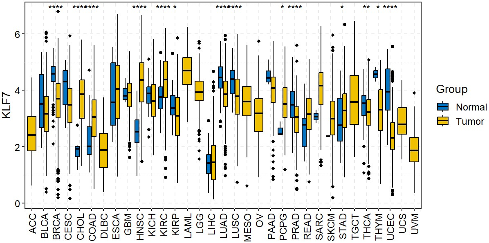

### 3.1.2 Pan-cancer paired tumor-normal boxplot

#### `pan_paired_boxplot`

Create a pan-cancer paired box plot for a single gene with symbols indicating statistical significance.


```r
pan_paired_boxplot(gene,palette="jco",legend="right",method="wilcox.test")
```

### Arguments

**gene**

gene name likes "KLF7".

**palette**

the color palette to be used for filling by groups. Allowed values include scientific journal palettes from ggsci R package, e.g.: "npg", "aaas", "lancet", "jco", "ucscgb", "uchicago", "simpsons" and "rickandmorty".

**legend**

legend position. Allowed values include "top","bottom","left","right" and "none".

**method**

a character string indicating which method to be used for comparing means including "wilcox.text" and "t.test". method="wilcox.test" is default.

**Example**


```r
pan_paired_boxplot("KLF7",legend = "none")
```
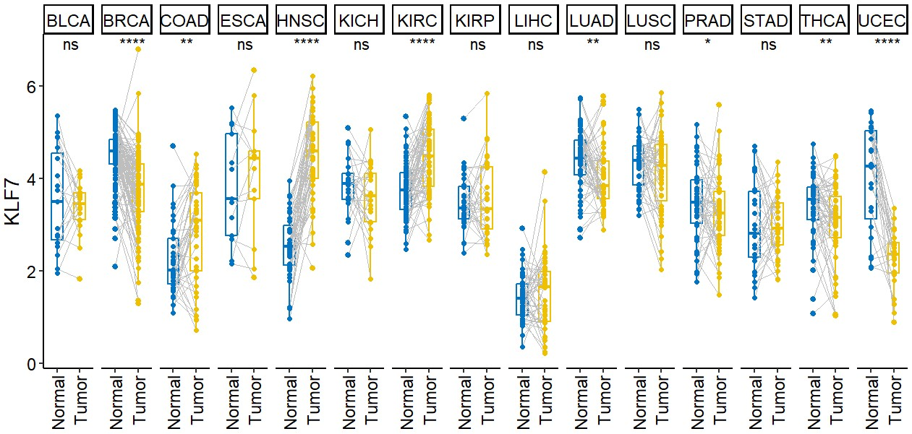

### 3.1.3 Pan-tumor boxplot

#### `pan_tumor_boxplot`

Create a pan-cancer box plot for a single gene in tumor samples.

```r
pan_tumor_boxplot(gene)
```

### Arguments

**gene**

gene name likes "KLF7".

**Example**

```r
pan_tumor_boxplot("KLF7")
```

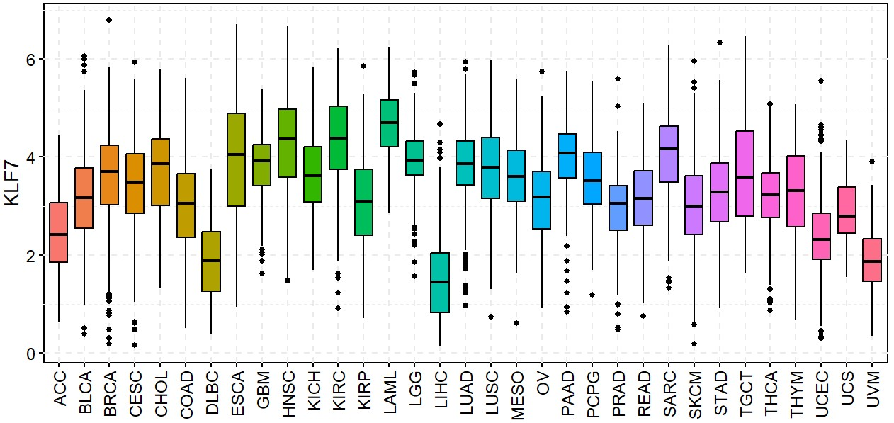

## 3.2 Pan-cancer correlation analysis

### 3.2.1 Pan-cancer gene expression and TMB correlation radar chart

#### `gene_TMB_radar`

Create a pan-cancer radar chart for gene expression and TMB correlation.


```r
gene_TMB_radar(gene,method = "pearson")
```

### Arguments

**gene**

gene name likes "KLF7".

**method**

method="pearson" is the default value. The alternatives to be passed to correlation are "spearman" and "kendall".

**Example**


```r
gene_TMB_radar("KLF7")
```
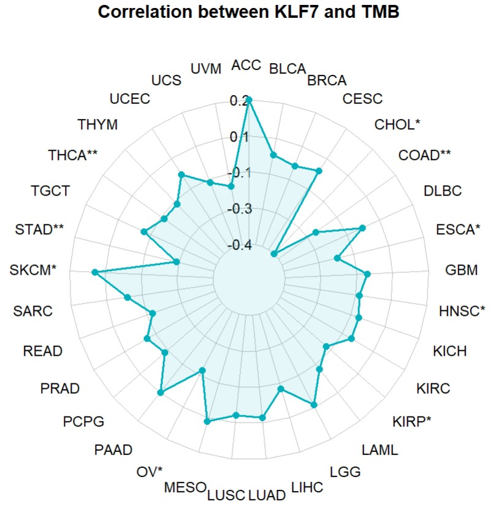

### 3.2.2 Pan-cancer gene expression and MSI correlation radar chart

#### `gene_MSI_radar`

Create a pan-cancer radar chart for gene expression and MSI correlation.


```r
gene_MSI_radar(gene,method = "pearson")
```

### Arguments

**gene** gene name likes "KLF7".

**method**

method="pearson" is the default value. The alternatives to be passed to correlation are "spearman" and "kendall".

**Example**


```r
gene_MSI_radar("KLF7")
```
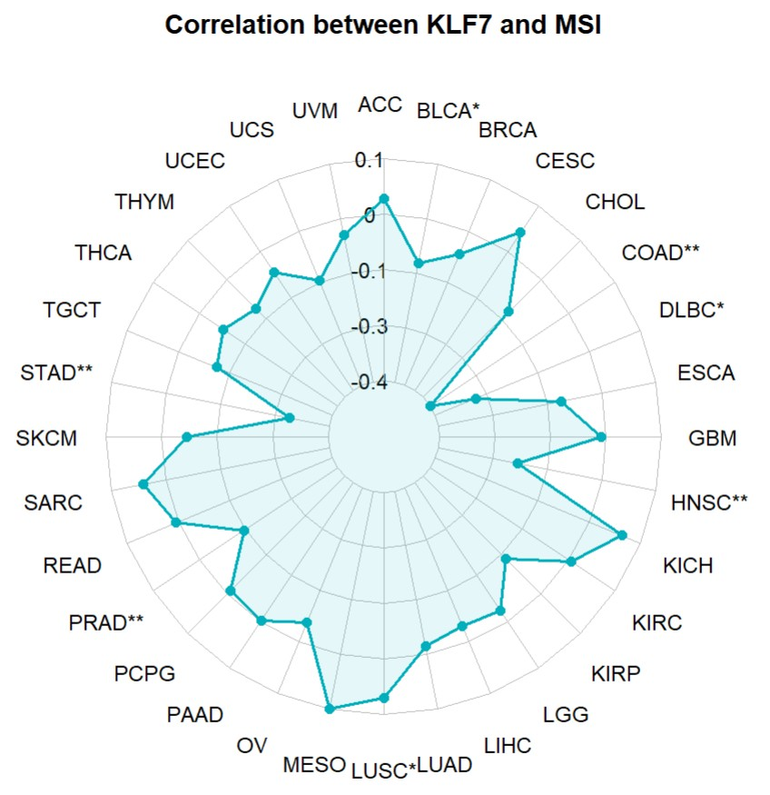

### 3.2.3 Pan-cancer gene expression and immune-related genes correlation

### 3.2.3.1 Pan-cancer gene expression and ICGs correlation

#### `gene_checkpoint_heatmap`

Create a pan-cancer heatmap with symbols indicating statistical significance to reveal the correlation between the expression of a single gene and ICGs (immune checkpoint genes).

ICGs geneset included "CD274","CTLA4","HAVCR2","LAG3","PDCD1","PDCD1LG2","SIGLEC15",and "TIGIT".


```r
gene_checkpoint_heatmap(gene,method="pearson",lowcol="blue",highcol="red",cluster_row=T,cluster_col=T,legend=T)
```

### Arguments

**gene**

gene name likes "KLF7".

**method**

method="pearson" is the default value. The alternatives to be passed to correlation are "spearman" and "kendall".

**lowcol**

 color for low point.

**highcol**

color for high point.

**cluster_row**

boolean values determining if rows should be clustered or hclust object.

**cluster_col**

boolean values determining if columns should be clustered or hclust object.

**legend**

 logical to determine if legend should be drawn or not.

**Example**


```r
gene_checkpoint_heatmap("KLF7")
```
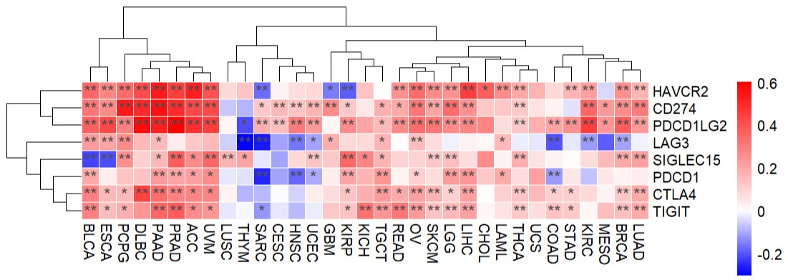

### 3.2.3.2 Pan-cancer gene expression and chemokine correlation

#### `gene_chemokine_heatmap`

Create a pan-cancer heatmap with symbols indicating statistical significance to reveal the correlation between the expression of a single gene and chemokine.

Chemokine geneset included "CCL1","CCL2","CCL3","CCL4","CCL5","CCL7","CCL8","CCL11","CCL13","CCL14","CCL15","CCL16","CCL17","CCL18","CCL19","CCL20","CCL21","CCL22","CCL23","CCL24","CCL25","CCL26","CCL28","CX3CL1","CXCL1","CXCL2","CXCL3","CXCL5","CXCL6","CXCL8","CXCL9","CXCL10","CXCL11","CXCL12","CXCL13","CXCL14","CXCL16", and "CXCL17".


```r
gene_chemokine_heatmap(gene,method="pearson",lowcol="blue",highcol="red",cluster_row=T,cluster_col=T,legend=T)
```

### Arguments

**gene**

gene name likes "KLF7".

**method**

method="pearson" is the default value. The alternatives to be passed to correlation are "spearman" and "kendall".

**lowcol**

 color for low point.

**highcol**

color for high point.

**cluster_row**

boolean values determining if rows should be clustered or hclust object.

**cluster_col**

boolean values determining if columns should be clustered or hclust object.

**legend**

 logical to determine if legend should be drawn or not.

**Example**


```r
gene_chemokine_heatmap("KLF7")
```
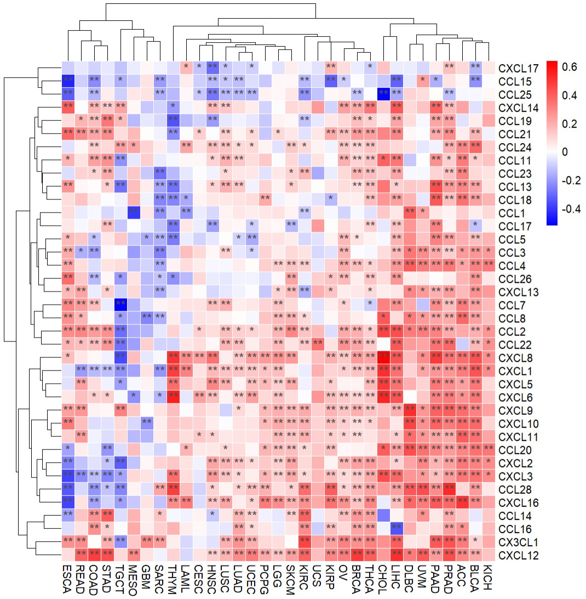

### 3.2.3.3 Pan-cancer gene expression and chemokine receptor correlation

#### `gene_receptor_heatmap`

Create a pan-cancer heatmap with symbols indicating statistical significance to reveal the correlation between the expression of a single gene and chemokine receptors.

Chemokine receptor geneset included "CCR1","CCR2","CCR3","CCR4","CCR5","CCR6","CCR7","CCR8","CCR9","CCR10", "CXCR1","CXCR2","CXCR3","CXCR4","CXCR5","CXCR6","XCR1", and "CX3R1".


```r
gene_receptor_heatmap(gene,method="pearson",lowcol="blue",highcol="red",cluster_row=T,cluster_col=T,legend=T)
```

### Arguments

**gene**

gene name likes "KLF7".

**method**

method="pearson" is the default value. The alternatives to be passed to correlation are "spearman" and "kendall".

**lowcol**

 color for low point.

**highcol**

color for high point.

**cluster_row**

boolean values determining if rows should be clustered or hclust object.

**cluster_col**

boolean values determining if columns should be clustered or hclust object.

**legend**

 logical to determine if legend should be drawn or not.

**Example**


```r
gene_receptor_heatmap("KLF7")
```
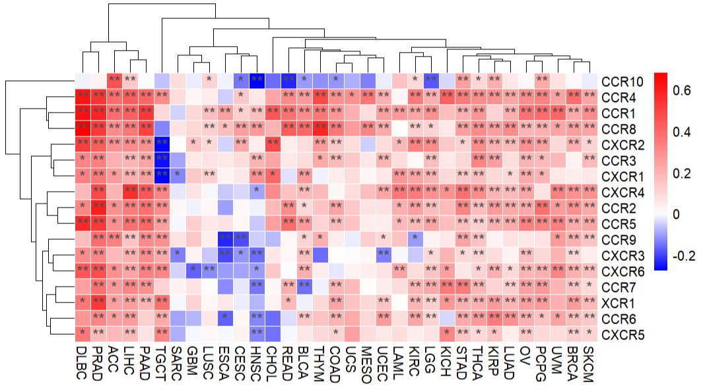

### 3.2.3.4 Pan-cancer gene expression and immune stimulator correlation

#### `gene_immustimulator_heatmap`

Create a pan-cancer heatmap with symbols indicating statistical significance to reveal the correlation between the expression of a single gene and immune stimulators.

Immune stimulator geneset included "CD27","CD276","CD28","CD40","CD40LG","CD48","CD70","CD80","CD86","CXCL12","CXCR4","ENTPD1","HHLA2","ICOS","ICOSLG","IL2RA","IL6","IL6R","KLRC1","KLRK1","LTA","MICB","NT5E","PVR","RAET1E","TMIGD2","TNFRSF13B","TNFRSF13C","TNFRSF14","TNFRSF17","TNFRSF18","TNFRSF25","TNFRSF4","TNFRSF8","TNFRSF9","TNFSF13","TNFSF13B","TNFSF14","TNFSF15","TNFSF18","TNFSF4","TNFSF9", and "ULBP1".


```r
gene_immustimulator_heatmap(gene,method="pearson",lowcol="blue",highcol="red",cluster_row=T,cluster_col=T,legend=T)
```

### Arguments

**gene**

gene name likes "KLF7".

**method**

method="pearson" is the default value. The alternatives to be passed to correlation are "spearman" and "kendall".

**lowcol**

 color for low point.

**highcol**

color for high point.

**cluster_row**

boolean values determining if rows should be clustered or hclust object.

**cluster_col**

boolean values determining if columns should be clustered or hclust object.

**legend**

 logical to determine if legend should be drawn or not.

**Example**


```r
gene_immustimulator_heatmap("KLF7")
```
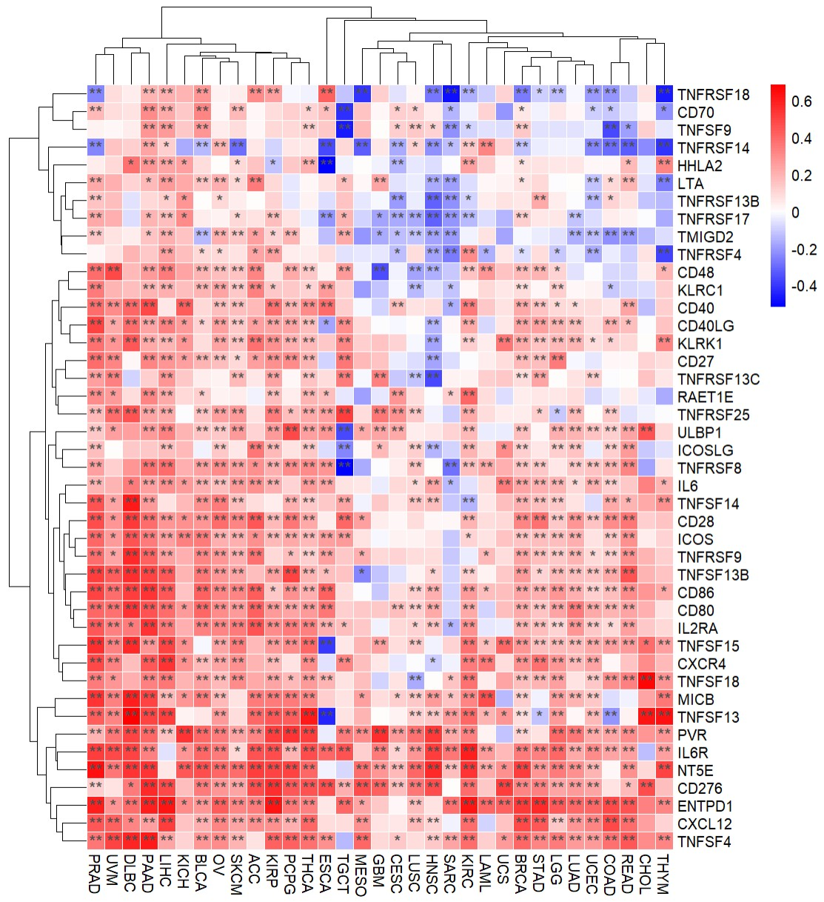

### 3.2.3.5 Pan-cancer gene expression and immune inhibitor correlation

#### `gene_immuinhibitor_heatmap`

Create a pan-cancer heatmap with symbols indicating statistical significance to reveal the correlation between the expression of a single gene and immune inhibitors.

Immune inhibitor geneset included "ADORA2A","BTLA","CD160","CD244","CD274","CD96","CSF1R","CTLA4","HAVCR2","IDO1","IL10","IL10RB","KDR","KIR2DL1","KIR2DL3","LAG3","LGALS9","PDCD1","PDCD1LG2","TGFB1","TGFBR1","TIGIT", and "VTCN1".


```r
gene_immuinhibitor_heatmap(gene,method="pearson",lowcol="blue",highcol="red",cluster_row=T,cluster_col=T,legend=T)
```

### Arguments

**gene**

gene name likes "KLF7".

**method**

method="pearson" is the default value. The alternatives to be passed to correlation are "spearman" and "kendall".

**lowcol**

 color for low point.

**highcol**

color for high point.

**cluster_row**

boolean values determining if rows should be clustered or hclust object.

**cluster_col**

boolean values determining if columns should be clustered or hclust object.

**legend**

 logical to determine if legend should be drawn or not.

**Example**


```r
gene_immuinhibitor_heatmap("KLF7")
```
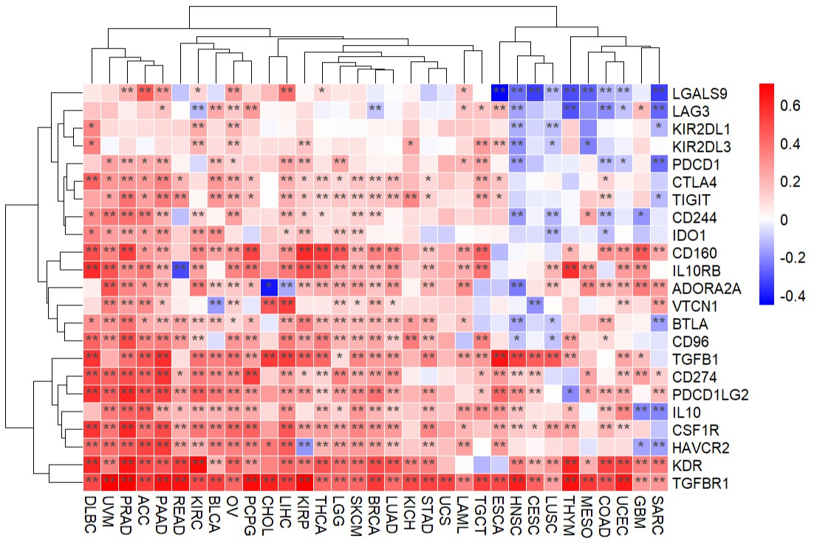

### 3.2.4 Pan-cancer gene expression and immune infiltration correlation

### 3.2.4.1 Pan-cancer gene expression and immune cell ratio correlation

#### `gene_immucell_heatmap`

Create a pan-cancer heatmap with symbols indicating statistical significance to reveal the correlation between the expression of a single gene and immune cell ratio.


```r
gene_immucell_heatmap(gene,method="pearson",lowcol="blue",highcol="red",cluster_row=T,cluster_col=T,legend=T)
```

### Arguments

**gene**

gene name likes "KLF7".

**method**

method="pearson" is the default value. The alternatives to be passed to correlation are "spearman" and "kendall".

**lowcol**

 color for low point.

**highcol**

color for high point.

**cluster_row**

boolean values determining if rows should be clustered or hclust object.

**cluster_col**

boolean values determining if columns should be clustered or hclust object.

**legend**

 logical to determine if legend should be drawn or not.

**Example**


```r
gene_immucell_heatmap("KLF7")
```


### 3.2.4.2 Pan-cancer gene expression and immune score correlation

#### `gene_immunescore_heatmap`

Create a pan-cancer heatmap with symbols indicating statistical significance to reveal the correlation between the expression of a single gene and immune scores, including Stromal score, immune score, and ESTIMATE score.


```r
gene_immunescore_heatmap(gene,method="pearson",lowcol="blue",highcol="red",cluster_row=T,cluster_col=T,legend=T)
```

### Arguments

**gene**

gene name likes "KLF7".

**method**

method="pearson" is the default value. The alternatives to be passed to correlation are "spearman" and "kendall".

**lowcol**

 color for low point.

**highcol**

color for high point.

**cluster_row**

boolean values determining if rows should be clustered or hclust object.

**cluster_col**

boolean values determining if columns should be clustered or hclust object.

**legend**

 logical to determine if legend should be drawn or not.

**Example**


```r
gene_immunescore_heatmap("KLF7")
```
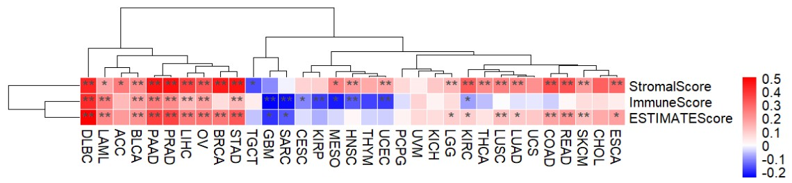

#### `gene_immunescore_triangle`

Create a pan-cancer triangle reveals the correlation between the expression of a single gene and immune scores, including Stromal score, immune score, and ESTIMATE score.


```r
gene_immunescore_triangle(gene,method="pearson")
```

### Arguments

**gene**

gene name likes "KLF7".

**method**

method="pearson" is the default value. The alternatives to be passed to correlation are "spearman" and "kendall".

**Example**


```r
gene_immunescore_triangle("KLF7")
```
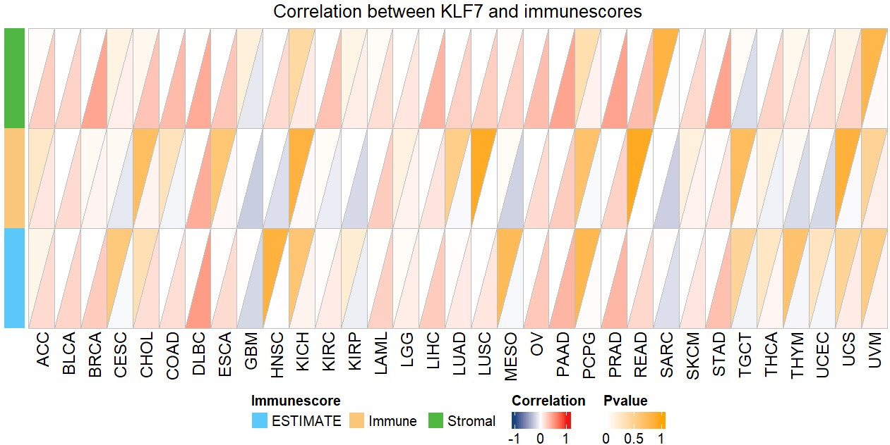

## 3.3 Pan-cancer Cox regression analysis

### 3.3.1 Pan-cancer Cox regression forest plot

#### `pan_forest`

Create a pan-cancer Cox regression forest plot for a specific gene.


```r
pan_forest(gene,adjust=F)
```

### Arguments

**gene**

gene name likes "KLF7".

**adjust **

adjust whether the Cox regression analysis was adjusted by age and stage. adjust=F is the default value.

**Example**


```r
pan_forest("KLF7")
```
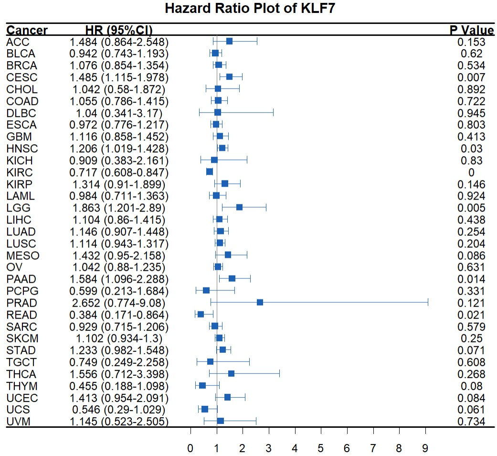

# 4. Cancer type specific analysis

## 4.1 Expression analysis

### 4.1.1 Expression analysis grouped by clinical information

#### 4.1.1.1 Tumor-normal boxplot

#### `tcga_boxplot`

Create a tumor-normal box plot for a single gene with symbols indicating statistical significance in a specific type of cancer.


```r
tcga_boxplot(cancer,gene,add = "jitter",palette="jco",legend="none",label="p.signif",method="wilcox.test")
```

### Arguments

**cancer**

cancer name likes "BRCA".

**gene**

gene name likes "KLF7".

**add**

character vector for adding another plot element likes "none", "dotplot", "jitter".

**palette**

the color palette to be used for coloring or filling by groups. Allowed values include scientific journal palettes from ggsci R package, e.g.: "npg", "aaas", "lancet", "jco".

**legend**

legend position. Allowed values include "top","bottom","left","right" and "none".

**label**

character string specifying label type. Allowed values include "p.signif" (shows the significance levels), "p.format" (shows the formatted p value). label="p.signif" is default.

**method**

a character string indicating which method to be used for comparing means including "wilcox.text" and "t.test". method="wilcox.test" is default.

**Example**


```r
tcga_boxplot("BRCA","KLF7")
```
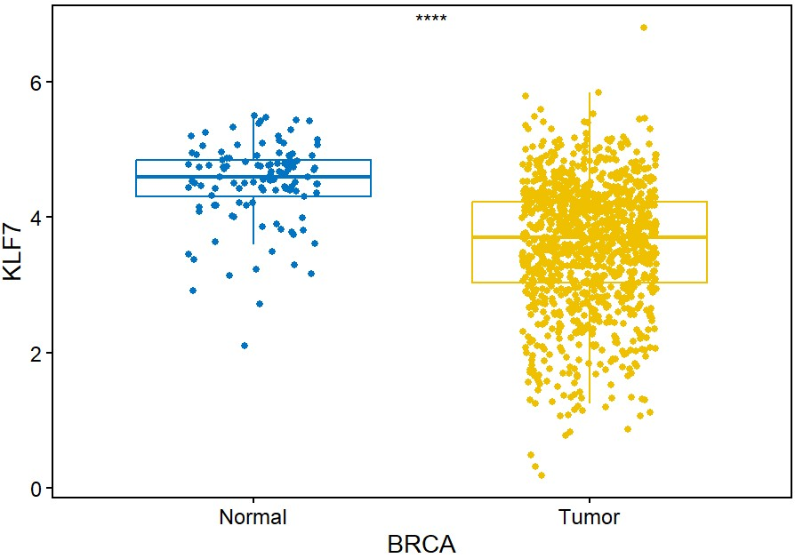

#### 4.1.1.2 Paired tumor-normal boxplot

#### `paired_boxplot`

Create a paired tumor-normal box plot for a single gene with symbols indicating statistical significance in a specific type of cancer.

Only cancers with more than 20 paired samples could be analyzed, including "BLCA","BRCA","COAD","ESCA","HNSC","KICH","KIRC","KIRP","LIHC","LUAD","LUSC","PRAD","STAD","THCA", and "UCEC".


```r
paired_boxplot(cancer,gene,palette="jco",legend="none",label="p.signif",method="wilcox.test")
```

### Arguments

**cancer**

cancer name likes "BRCA".

**gene**

gene name likes "KLF7".

**palette**

the color palette to be used for coloring or filling by groups. Allowed values include scientific journal palettes from ggsci R package, e.g.: "npg", "aaas", "lancet", "jco".

**legend**

legend position. Allowed values include "top","bottom","left","right" and "none".

**label**

character string specifying label type. Allowed values include "p.signif" (shows the significance levels), "p.format" (shows the formatted p value). label="p.signif" is default.

**method**

a character string indicating which method to be used for comparing means including "wilcox.text" and "t.test". method="wilcox.test" is default.

**Example**


```r
paired_boxplot("BRCA","KLF7")
```
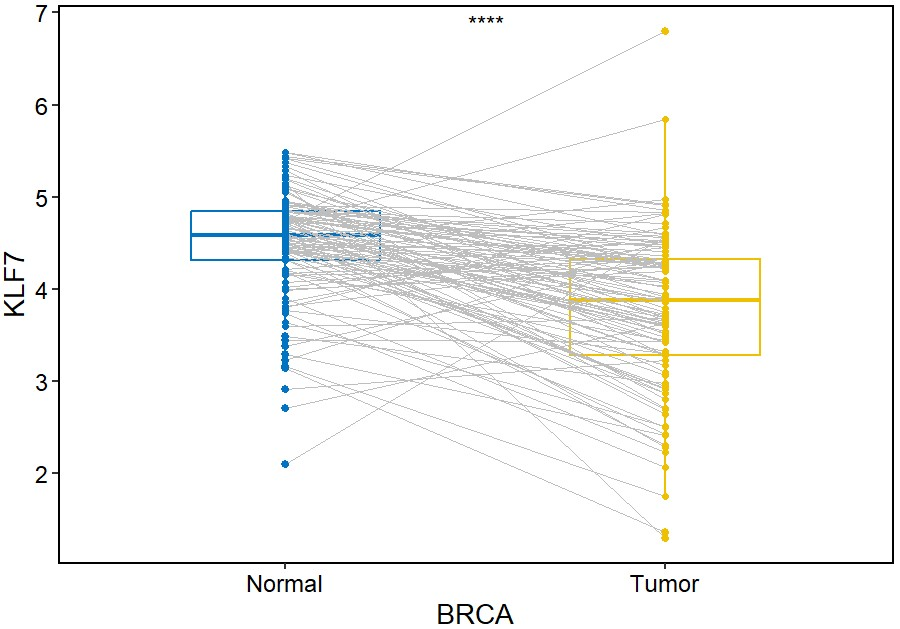

#### 4.1.1.3 Age grouped boxplot

#### `gene_age`

Create a box plot for a single gene with symbols indicating statistical significance grouped by age in a specific type of cancer.


```r
gene_age(cancer,gene,age=60,add = "jitter",palette="jco",legend="none",label="p.signif",method="wilcox.test")
```

### Arguments

**cancer**

cancer name likes "ACC".

**gene**

gene name likes "KLF7".

**age**

numeric number of age like 60.

**add**

character vector for adding another plot element likes "none", "dotplot", "jitter".

**palette**

the color palette to be used for coloring or filling by groups. Allowed values include scientific journal palettes from ggsci R package, e.g.: "npg", "aaas", "lancet", "jco".

**legend**

legend position. Allowed values include "top","bottom","left","right" and "none".

**label**

character string specifying label type. Allowed values include "p.signif" (shows the significance levels), "p.format" (shows the formatted p value). label="p.signif" is default.

**method**

a character string indicating which method to be used for comparing means including "wilcox.text" and "t.test". method="wilcox.test" is default.

**Example**


```r
gene_age("ACC","KLF7")
```
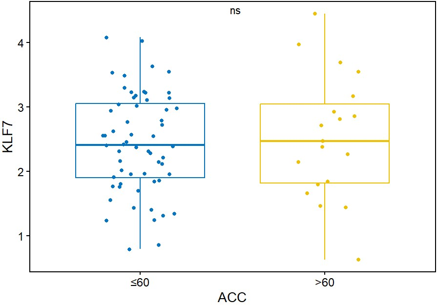

#### `gene_3age`

Create a box plot for a single gene grouped by three age groups in a specific type of cancer.

```r
gene_3age(cancer,gene,age1=40,age2=60,add = "jitter",palette="jco",legend="none",label="p.signif",method="wilcox.test")
```

### Arguments

**cancer**

cancer name likes "ACC".

**gene**

gene name likes "KLF7".

**age**

numeric number of age like 60.

**add**

character vector for adding another plot element likes "none", "dotplot", "jitter".

**palette**

the color palette to be used for coloring or filling by groups. Allowed values include scientific journal palettes from ggsci R package, e.g.: "npg", "aaas", "lancet", "jco".

**legend**

legend position. Allowed values include "top","bottom","left","right" and "none".

**legend**

legend position. Allowed values include "top","bottom","left","right" and "none".

**label**

character string specifying label type. Allowed values include "p.signif" (shows the significance levels), "p.format" (shows the formatted p value). label="p.signif" is default.

**method**

a character string indicating which method to be used for comparing means including "wilcox.text" and "t.test". method="wilcox.test" is default.

**Example**

```r
gene_3age("COAD","KLF7", age1=40, age2=60)
```

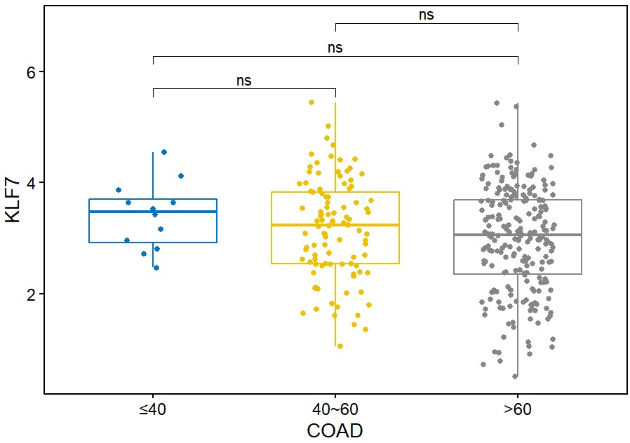

#### 4.1.1.4 Gender grouped boxplot

#### `gene_gender`

Create a box plot for a single gene with symbols indicating statistical significance grouped by gender in a specific type of cancer.


```r
gene_gender(cancer,gene,add = "jitter",palette="jco",legend="none",label="p.signif",method="wilcox.test")
```

### Arguments

**cancer**

cancer name likes "BLCA".

**gene**

gene name likes "KLF7".

**add**

character vector for adding another plot element likes "none", "dotplot", "jitter".

**palette**

the color palette to be used for coloring or filling by groups. Allowed values include scientific journal palettes from ggsci R package, e.g.: "npg", "aaas", "lancet", "jco".

**legend**

legend position. Allowed values include "top","bottom","left","right" and "none".

**label**

character string specifying label type. Allowed values include "p.signif" (shows the significance levels), "p.format" (shows the formatted p value). label="p.signif" is default.

**method**

a character string indicating which method to be used for comparing means including "wilcox.text" and "t.test". method="wilcox.test" is default.

**Example**


```r
gene_gender("BLCA","KLF7")
```
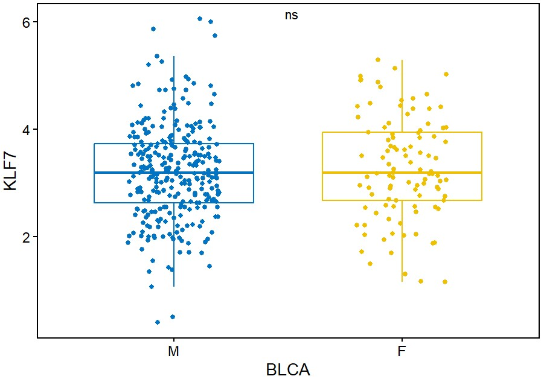

#### 4.1.1.5 Stage grouped boxplot

#### `gene_stage`

Create a box plot for a single gene with symbols indicating statistical significance grouped by stage in a specific type of cancer.


```r
gene_stage(cancer,gene,add = "jitter",palette="jco",legend="none",label="p.signif",method="wilcox.test")
```

### Arguments

**cancer**

cancer name likes "COAD".

**gene**

gene name likes "KLF7".

**add**

character vector for adding another plot element likes "none", "dotplot", "jitter".

**palette**

the color palette to be used for coloring or filling by groups. Allowed values include scientific journal palettes from ggsci R package, e.g.: "npg", "aaas", "lancet", "jco".

**legend**

legend position. Allowed values include "top","bottom","left","right" and "none".

**label**

character string specifying label type. Allowed values include "p.signif" (shows the significance levels), "p.format" (shows the formatted p value). label="p.signif" is default.

**method**

a character string indicating which method to be used for comparing means including "wilcox.text" and "t.test". method="wilcox.test" is default.

**Example**


```r
gene_stage("COAD","KLF7")
```
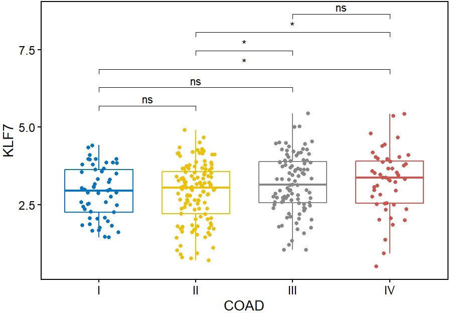

### 4.1.2 Expression analysis grouped by the expression of a spcecific gene

#### 4.1.2.1 Differential expressed gene heatmap grouped by a specific gene

#### `gene_deg_heatmap`

Create a heatmap for differentially expressed genes grouped by the expression of a single gene in a specific type of cancer.


```r
gene_deg_heatmap(cancer, gene,top_n=20)
```

### Arguments

**cancer**

cancer name likes "BLCA".

**gene**

gene name likes "KLF7".

**top_n**

the number of top DEGS to be shown in the heatmap.

**Example**


```r
gene_deg_heatmap("BLCA","KLF7")
```
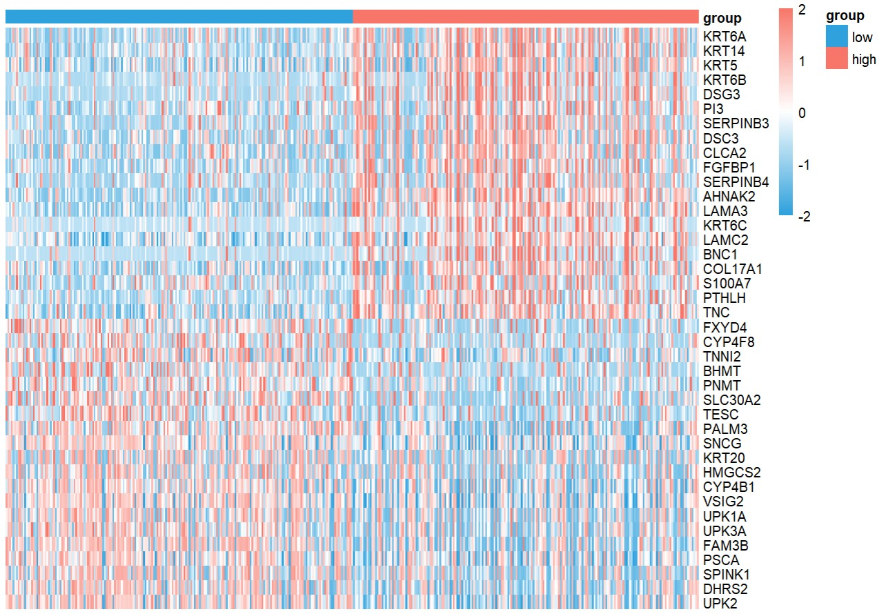

#### 4.1.2.2 GSEA-GO grouped by the expression of a spcecific gene

#### `gene_gsea_go`

GSEA-GO analysis of DEGs grouped by the expression of a single gene in a specific type of cancer, and the top 5 GO BP pathways were shown.


```r
gene_gsea_go(cancer,gene)
```

### Arguments

**cancer**

cancer name likes "BLCA".

**gene**

gene name likes "KLF7".

**Example**


```r
gene_gsea_go("BLCA","KLF7")
```
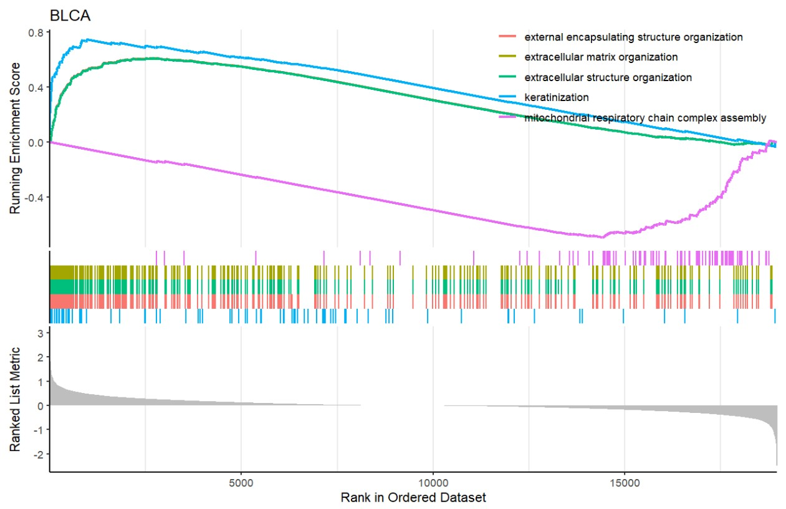

#### 4.1.2.3 GSEA-KEGG grouped by the expression of a spcecific gene

#### `gene_gsea_kegg`

GSEA-KEGG analysis of DEGs grouped by the expression of a single gene in a specific type of cancer, and the top 5 KEGG pathways were shown.


```r
gene_gsea_kegg(cancer,gene)
```

### Arguments

**cancer**

cancer name likes "BLCA".

**gene**

gene name likes "KLF7".

**Example**


```r
gene_gsea_kegg("BLCA","KLF7")
```
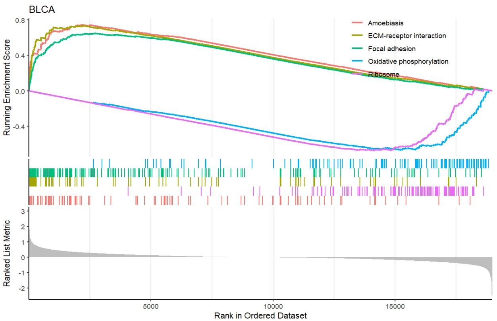

## 4.2 Diagnostic ROC Curve

#### `tcga_roc`

Diagnostic ROC curve of a single gene in a specific type of cancer.


```r
tcga_roc(cancer,gene)
```

### Arguments

**cancer**

cancer name likes "BRCA".

**gene**

gene name likes "KLF7".

**Example**


```r
tcga_roc("BRCA","KLF7")
```
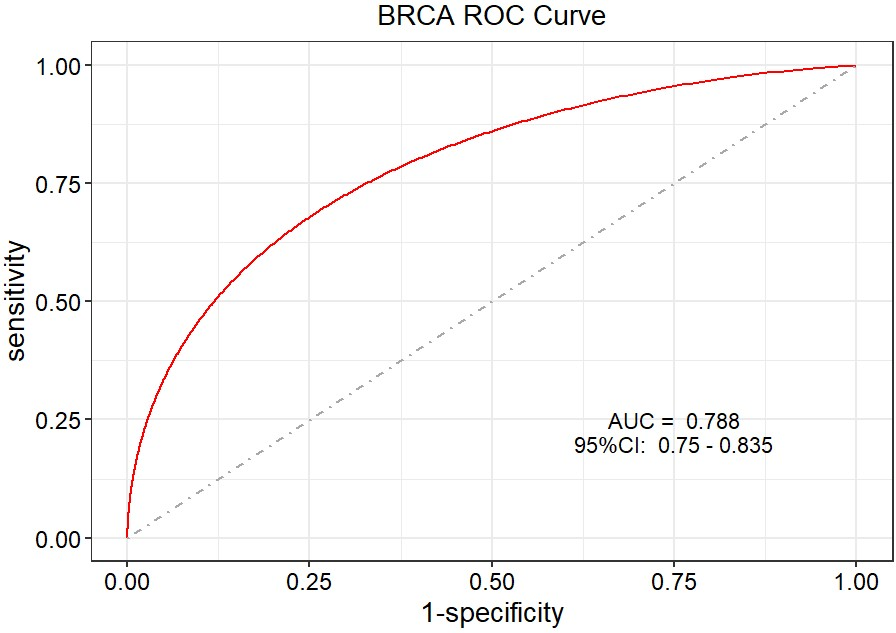

## 4.3 Cancer type specific correlation analysis

### 4.3.1 Gene-gene correlation scatter

#### `gene_gene_scatter`

Scatter plot of gene and gene correlation in a specific type cancer.


```r
gene_gene_scatter(cancer,gene1,gene2,density="F")
```

### Arguments

**cancer**

cancer name likes "BLCA".

**gene1**

name of gene1 likes "CBX2".

**gene2**

name of gene1 likes "CBX3".

**density**

whether density of gene expression was shown.

**Example**


```r
gene_gene_scatter("BLCA","CBX2","CBX3")
gene_gene_scatter("BLCA","CBX2","CBX3",density="T")
```
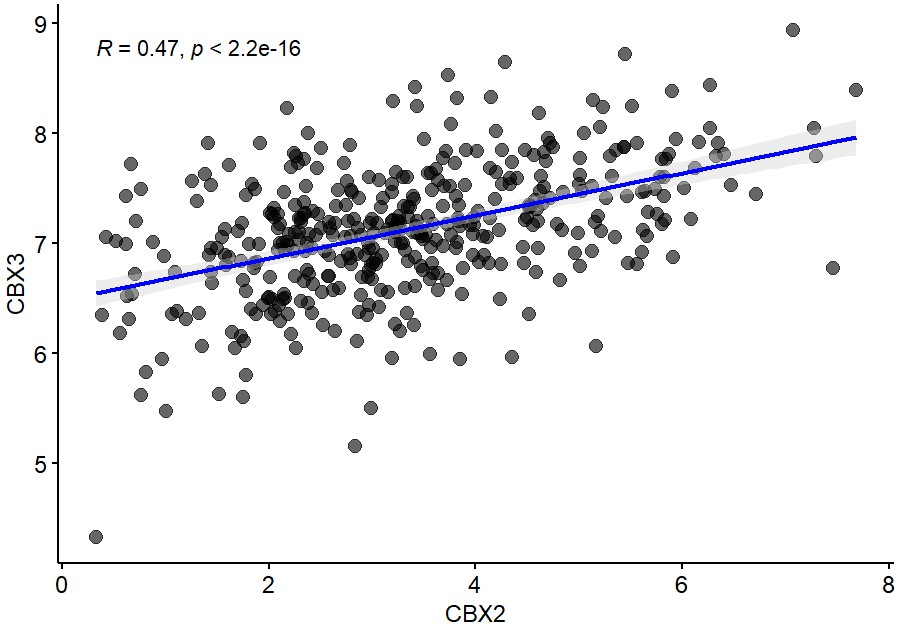
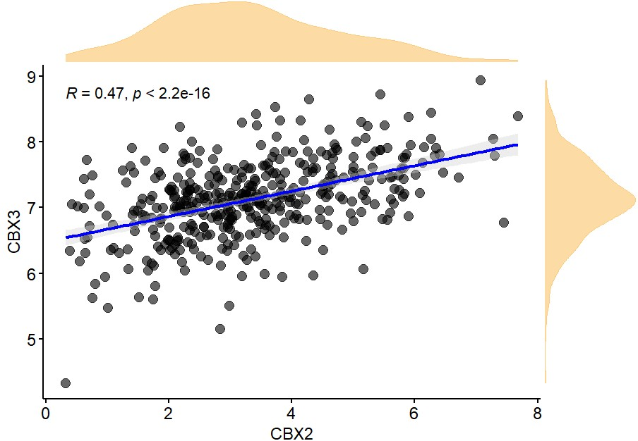

### 4.3.2 Gene-promoter methylation correlation scatter

#### `gene_methylation_scatter`

Scatter plot of gene expression and gene promoter methylation correlation in a specific type of cancer. A pdf file will be generated in the working directory.


```r
gene_methylation_scatter(cancer,gene)
```

### Arguments

**cancer**

cancer name likes "BLCA".

**gene**

gene name likes "KLF7".

**Example**


```r
gene_methylation_scatter("BLCA","KLF7")
```
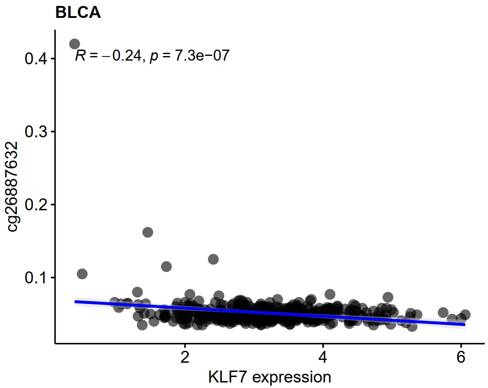

### 4.3.3 Expression heatmap of significantly correlated genes and GO analysis

#### `gene_coexp_heatmap`

Heatmap and Go enrichment of the positive and negative co-expressed genes of a single gene in a specific type of cancer.


```r
gene_coexp_heatmap(cancer,gene,top_n=20, method="pearson")
```

### Arguments

**cancer**

cancer name likes "STAD".

**gene**

gene name likes "KLF7".

**top_n** the number of co-expressed genes.

**method** method="pearson" is the default value. The alternatives to be passed to correlation were "spearman" and "kendall".

**Example**


```r
gene_coexp_heatmap("STAD","KLF7")
```
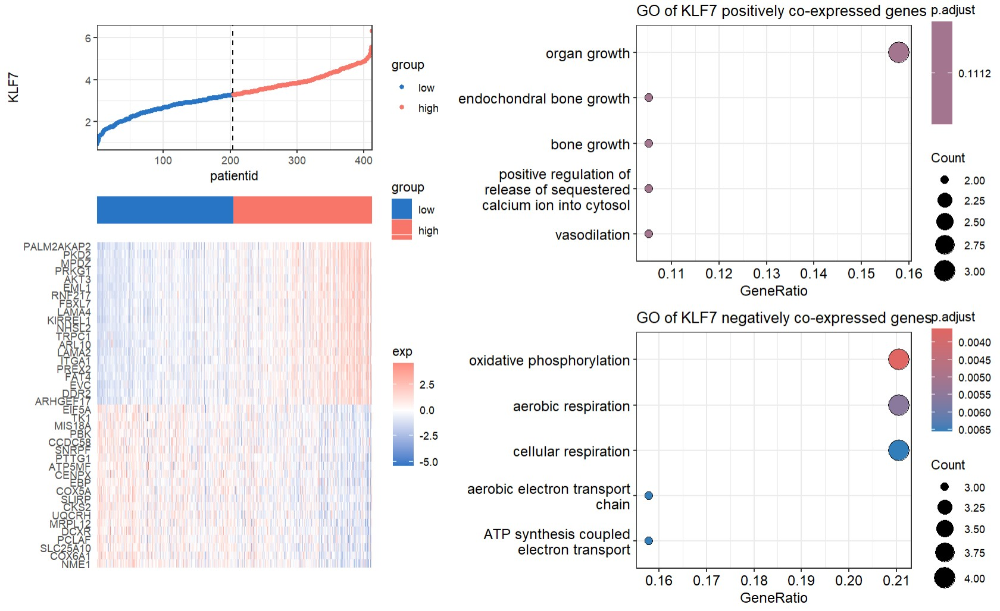

## 4.4 Survavial analysis

### 4.4.1 Survavial analysis based on the expression of a single gene

#### `tcga_kmplot`

K_M survival plot for a single gene in a specific type of cancer.


```r
tcga_kmplot(cancer,gene,palette='jco')
```

### Arguments

**cancer**

cancer name likes "COAD".

**gene**

gene name likes "KLF7".

**palette** the color palette to be used for coloring or filling by groups. Allowed values include scientific journal palettes from ggsci R package, e.g.: "npg", "aaas", "lancet", "jco".

**Example**


```r
tcga_kmplot("COAD","KLF7")
```
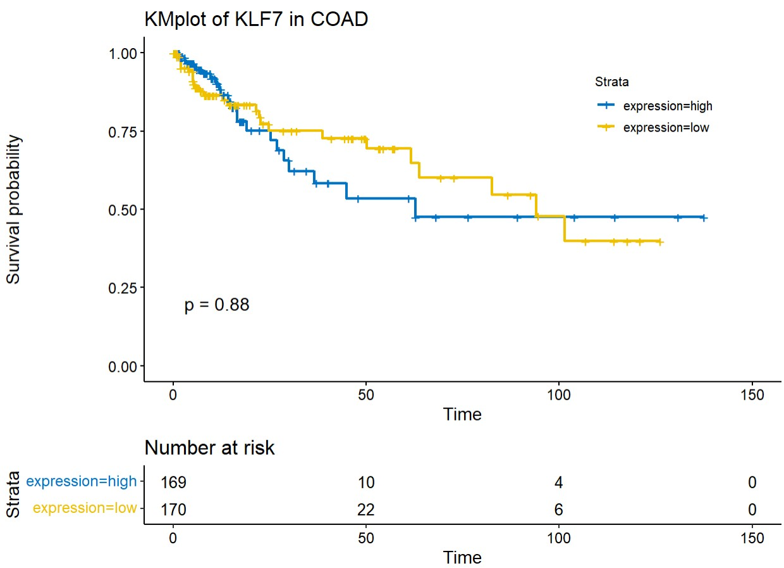

### 4.4.2 Survavial analysis based on the promoter methylation of a spcecific gene

#### `methy_kmplot`

Describes the K_M survival plot based on the promoter methylation of a single gene in a specific type of cancer. A pdf file will be generated in the working directory.


```r
methy_kmplot(cancer,gene,palette='jco')
```

### Arguments

**cancer**

cancer name likes "COAD".

**gene**

gene name likes "KLF7".

**palette** the color palette to be used for coloring or filling by groups. Allowed values include scientific journal palettes from ggsci R package, e.g.: "npg", "aaas", "lancet", "jco".

**Example**


```r
methy_kmplot("COAD","KLF7")
```
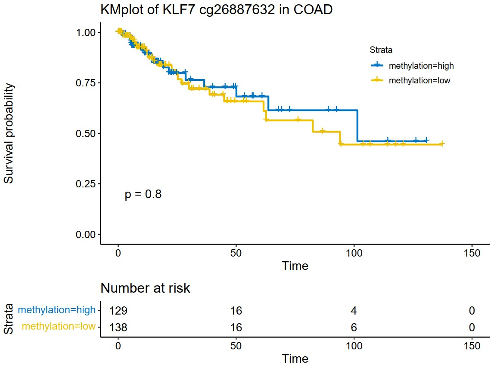

# 5. Gene network analysis

This function is performed by the clusterProfiler and enrichplot R packages.

## 5.1 Gene network GO analysis

#### `gene_network_go`

Create a cnetplot to depict the linkages of gene(s) and GO terms as a network.

```r
gene_network_go(gene)
```

### Arguments

**gene**

gene name likes "KLF7", or a vector of gene names like c("LAMA3","LAMC2","TNC","OSMR").

**Example**

```r
gene_network_go(c("LAMA3","LAMC2","TNC","OSMR"))
```

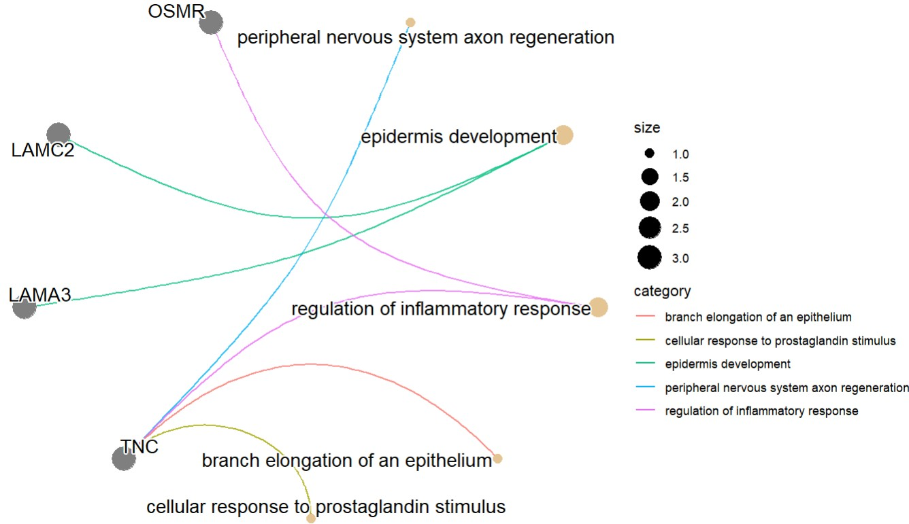

## 5.2 Gene network KEGG analysis

#### `gene_network_kegg`

Create a cnetplot to depict the linkages of gene(s) and KEGG pathways as a network.

```r
gene_network_kegg(gene)
```

### Arguments

**gene**

gene name likes "KLF7", or a vector of gene names like c("LAMA3","LAMC2","TNC","OSMR").

**Example**

```r
gene_network_kegg(c("LAMA3","LAMC2","TNC","OSMR"))
```


# 6. Geneset based analysis

Both geneset listed in MSigDB and user defined geneset in the form of character vector were supported to perform geneset based pan-cancer and cancer type specific analysis. `get_geneset()` function could extract the whole built in geneset list from MSigDB.

## 6.1 Geneset based pan-cancer expression analysis

### 6.1.1 Geneset based pan-cancer tumor-normal boxplot

#### `gs_pan_boxplot`

Create a pan-cancer box plot for a geneset with symbols indicating statistical significance.

```r
gs_pan_boxplot(geneset,geneset_alias,palette="jco",legend="right",method="wilcox.test")
```

### Arguments

**geneset**

geneset name likes "ALONSO_METASTASIS_EMT_DN" or a character vector like c("KLF4","KLF7").

**geneset_alias**

geneset alias name for plotting likes "METASTASIS EMT".

**palette**

the color palette to be used for filling by groups. Allowed values include scientific journal palettes from ggsci R package, e.g.: "npg", "aaas", "lancet", "jco", "ucscgb", "uchicago", "simpsons" and "rickandmorty".

**legend**

legend position. Allowed values include "top","bottom","left","right" and "none".

**method**

a character string indicating which method to be used for comparing means including "wilcox.text" and "t.test". method="wilcox.test" is default.

**Example**

```r
gs_pan_boxplot("ALONSO_METASTASIS_EMT_DN","METASTASIS EMT")
```

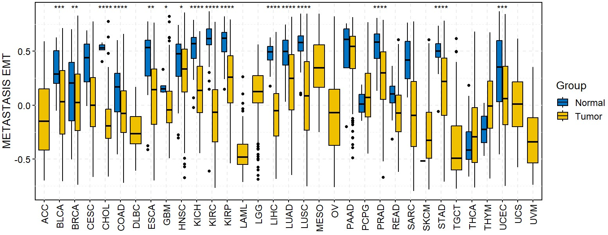

### 6.1.2 Geneset based pan-cancer paired tumor-normal boxplot

#### `gs_pan_paired_boxplot`

Create a pan-cancer paired box plot for a geneset with symbols indicating statistical significance.

```r
gs_pan_paired_boxplot(geneset,geneset_alias,palette="jco",legend="right",method="wilcox.test")
```

### Arguments

**geneset**

geneset name likes "ALONSO_METASTASIS_EMT_DN" or a character vector like c("KLF4","KLF7").

**geneset_alias**

geneset alias name for plotting likes "METASTASIS EMT".

**palette**

the color palette to be used for filling by groups. Allowed values include scientific journal palettes from ggsci R package, e.g.: "npg", "aaas", "lancet", "jco", "ucscgb", "uchicago", "simpsons" and "rickandmorty".

**legend**

legend position. Allowed values include "top","bottom","left","right" and "none".

**method**

a character string indicating which method to be used for comparing means including "wilcox.text" and "t.test". method="wilcox.test" is default.

**Example**

```r
gs_pan_paired_boxplot("ALONSO_METASTASIS_EMT_DN","ALONSO_METASTASIS_EMT_DN")
```

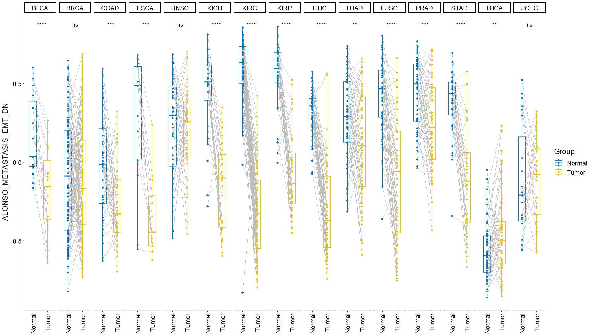

### 6.1.3 Geneset based pan-tumor boxplot

#### `gs_pan_tumor_boxplot`

Create a pan-cancer box plot for a single gene in tumor samples.

```r
gs_pan_tumor_boxplot(geneset,geneset_alias)
```

### Arguments

**geneset**

geneset name likes "ALONSO_METASTASIS_EMT_DN" or a character vector like c("KLF4","KLF7").

**geneset_alias**

geneset alias name for plotting likes "METASTASIS EMT".

**Example**

```r
gs_pan_tumor_boxplot("ALONSO_METASTASIS_EMT_DN","ALONSO_METASTASIS_EMT_DN")
```

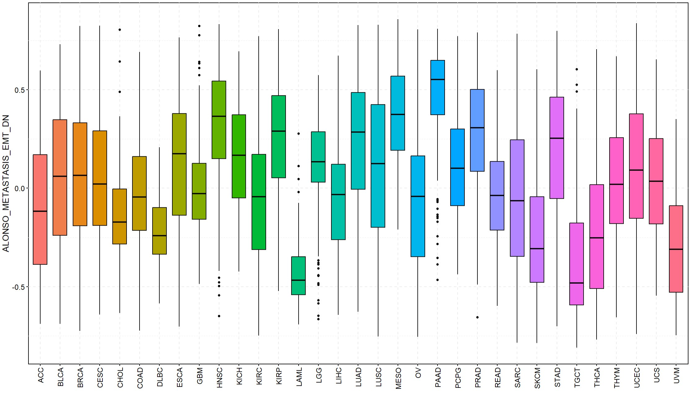

## 6.2 Geneset based pan-cancer correlation analysis

### 6.2.1 Geneset based pan-cancer correlation with TMB

#### `gs_TMB_radar`

Create a pan-cancer radar chart for geneset and TMB correlation.

```r
gs_TMB_radar(geneset,geneset_alias,method = "pearson")
```

### Arguments

**geneset**

geneset name likes "ALONSO_METASTASIS_EMT_DN" or a character vector like c("KLF4","KLF7").

**geneset_alias**

geneset alias name for plotting likes "METASTASIS EMT".

**method**

method="pearson" is the default value. The alternatives to be passed to correlation are "spearman" and "kendall".

**Example**

```r
# We defined a geneset.
klf=c("KLF4","KLF7")
gs_TMB_radar(geneset=klf,geneset_alias="KLF family")
```

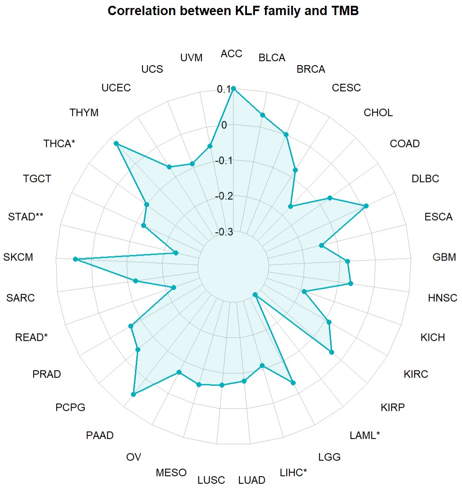

### 6.2.2 Geneset based pan-cancer correlation with MSI

#### `gs_MSI_radar`

Create a pan-cancer radar chart for geneset and MSI correlation.

```r
gs_MSI_radar(geneset,geneset_alias,method = "pearson")
```

### Arguments

**geneset**

geneset name likes "ALONSO_METASTASIS_EMT_DN" or a character vector like c("KLF4","KLF7").

**geneset_alias**

geneset alias name for plotting likes "METASTASIS EMT".

**method**

method="pearson" is the default value. The alternatives to be passed to correlation are "spearman" and "kendall".

**Example**

```r
gs_MSI_radar("ALONSO_METASTASIS_EMT_DN","METASTASIS EMT")
```

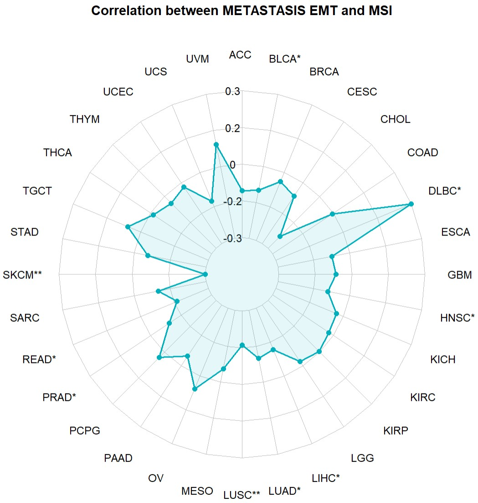

### 6.2.3 Genset based pan-cancer correlation with immune-related genes

### 6.2.3.1 Genset based pan-cancer correlation with ICGs

#### `gs_checkpoint_heatmap`

Create a pan-cancer heatmap with symbols indicating statistical significance to reveal the correlation between the expression of a geneset and ICGs (immune checkpoint genes)..

ICGs geneset included "CD274","CTLA4","HAVCR2","LAG3","PDCD1","PDCD1LG2","SIGLEC15",and "TIGIT".

```r
gs_checkpoint_heatmap(geneset,method="pearson",lowcol="blue",highcol="red",
                               cluster_row=T,cluster_col=T,legend=T)
```

### Arguments

**geneset**

geneset name likes "ALONSO_METASTASIS_EMT_DN" or a character vector like c("KLF4","KLF7").

**method**

method="pearson" is the default value. The alternatives to be passed to correlation are "spearman" and "kendall".

**lowcol**

 color for low point.

**highcol**

color for high point.

**cluster_row**

boolean values determining if rows should be clustered or hclust object.

**cluster_col**

boolean values determining if columns should be clustered or hclust object.

**legend**

 logical to determine if legend should be drawn or not.

**Example**

```r
gs_checkpoint_heatmap("ALONSO_METASTASIS_EMT_DN")
```

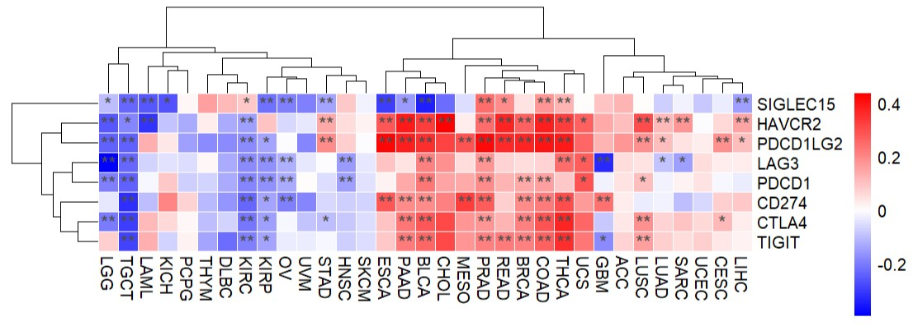

### 6.2.3.2 Genset based pan-cancer correlation with chemokine

#### `gs_chemokine_heatmap`

Create a pan-cancer heatmap with symbols indicating statistical significance to reveal the correlation between the expression of a geneset and chemokine.

Chemokine geneset included "CCL1","CCL2","CCL3","CCL4","CCL5","CCL7","CCL8","CCL11","CCL13","CCL14","CCL15","CCL16","CCL17","CCL18","CCL19","CCL20","CCL21","CCL22","CCL23","CCL24","CCL25","CCL26","CCL28","CX3CL1","CXCL1","CXCL2","CXCL3","CXCL5","CXCL6","CXCL8","CXCL9","CXCL10","CXCL11","CXCL12","CXCL13","CXCL14","CXCL16", and "CXCL17".

```r
gs_chemokine_heatmap(geneset,method="pearson",lowcol="blue",highcol="red",cluster_row=T,cluster_col=T,legend=T)
```

### Arguments

**geneset**

geneset name likes "ALONSO_METASTASIS_EMT_DN" or a character vector like c("KLF4","KLF7").

**method**

method="pearson" is the default value. The alternatives to be passed to correlation are "spearman" and "kendall".

**lowcol**

 color for low point.

**highcol**

color for high point.

**cluster_row**

boolean values determining if rows should be clustered or hclust object.

**cluster_col**

boolean values determining if columns should be clustered or hclust object.

**legend**

 logical to determine if legend should be drawn or not.

**Example**

```r
gs_chemokine_heatmap("ALONSO_METASTASIS_EMT_DN")
```

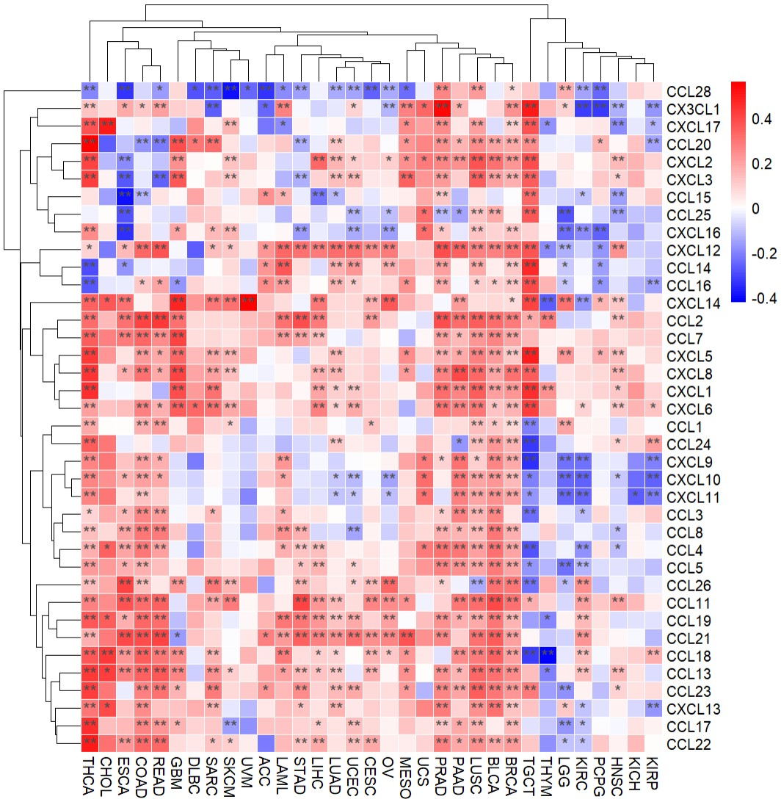

### 6.2.3.3 Genset based pan-cancer correlation with chemokine receptor

#### `gs_receptor_heatmap`

Create a pan-cancer heatmap with symbols indicating statistical significance to reveal the correlation between the expression of a geneset and chemokine receptors.

Chemokine receptor geneset included "CCR1","CCR2","CCR3","CCR4","CCR5","CCR6","CCR7","CCR8","CCR9","CCR10", "CXCR1","CXCR2","CXCR3","CXCR4","CXCR5","CXCR6","XCR1", and "CX3R1".

```r
gs_receptor_heatmap(geneset,method="pearson",lowcol="blue",highcol="red",cluster_row=T,cluster_col=T,legend=T)
```

### Arguments

**geneset**

geneset name likes "ALONSO_METASTASIS_EMT_DN" or a character vector like c("KLF4","KLF7").

**method**

method="pearson" is the default value. The alternatives to be passed to correlation are "spearman" and "kendall".

**lowcol**

 color for low point.

**highcol**

color for high point.

**cluster_row**

boolean values determining if rows should be clustered or hclust object.

**cluster_col**

boolean values determining if columns should be clustered or hclust object.

**legend**

 logical to determine if legend should be drawn or not.

**Example**

```r
gs_receptor_heatmap("ALONSO_METASTASIS_EMT_DN")
```

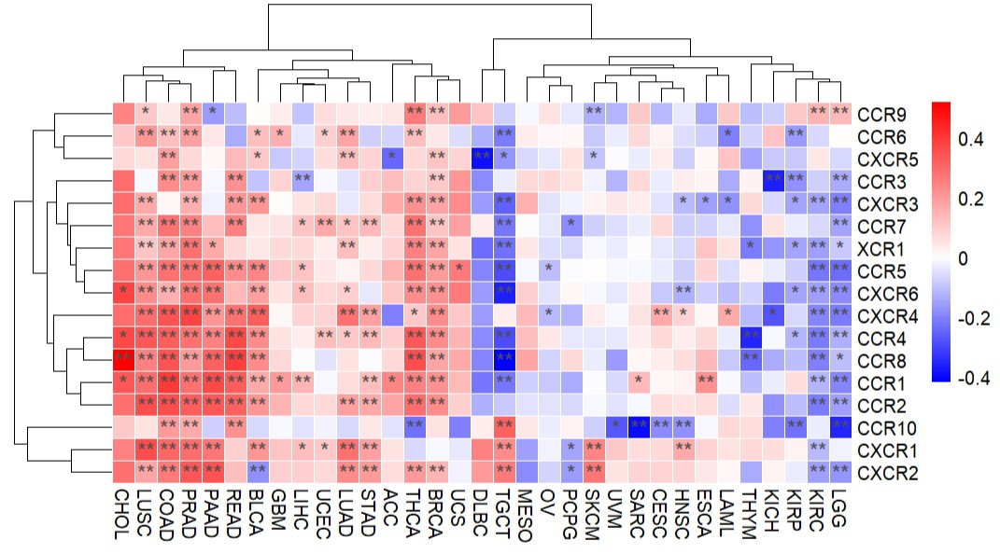

### 6.2.3.4 Genset based pan-cancer correlation with immune stimulator

#### `gs_immustimulator_heatmap`

Create a pan-cancer heatmap with symbols indicating statistical significance to reveal the correlation between the expression of a geneset and immune stimulators.

Immune stimulator geneset included "CD27","CD276","CD28","CD40","CD40LG","CD48","CD70","CD80","CD86","CXCL12","CXCR4","ENTPD1","HHLA2","ICOS","ICOSLG","IL2RA","IL6","IL6R","KLRC1","KLRK1","LTA","MICB","NT5E","PVR","RAET1E","TMIGD2","TNFRSF13B","TNFRSF13C","TNFRSF14","TNFRSF17","TNFRSF18","TNFRSF25","TNFRSF4","TNFRSF8","TNFRSF9","TNFSF13","TNFSF13B","TNFSF14","TNFSF15","TNFSF18","TNFSF4","TNFSF9", and "ULBP1".

```r
gs_immustimulator_heatmap(geneset,method="pearson",lowcol="blue",highcol="red",cluster_row=T,cluster_col=T,legend=T)
```

### Arguments

**geneset**

geneset name likes "ALONSO_METASTASIS_EMT_DN" or a character vector like c("KLF4","KLF7").

**method**

method="pearson" is the default value. The alternatives to be passed to correlation are "spearman" and "kendall".

**lowcol**

 color for low point.

**highcol**

color for high point.

**cluster_row**

boolean values determining if rows should be clustered or hclust object.

**cluster_col**

boolean values determining if columns should be clustered or hclust object.

**legend**

 logical to determine if legend should be drawn or not.

**Example**

```r
gs_immustimulator_heatmap("ALONSO_METASTASIS_EMT_DN")
```


### 6.2.3.5 Genset based pan-cancer correlation with immune inhibitor 

#### `gs_immuinhibitor_heatmap`

Create a pan-cancer heatmap with symbols indicating statistical significance to reveal the correlation between the expression of a geneset and immune inhibitors.

Immune inhibitor geneset included "ADORA2A","BTLA","CD160","CD244","CD274","CD96","CSF1R","CTLA4","HAVCR2","IDO1","IL10","IL10RB","KDR","KIR2DL1","KIR2DL3","LAG3","LGALS9","PDCD1","PDCD1LG2","TGFB1","TGFBR1","TIGIT", and "VTCN1".

```r
gs_immuinhibitor_heatmap(geneset,method="pearson",lowcol="blue",highcol="red",cluster_row=T,cluster_col=T,legend=T)
```

### Arguments

**geneset**

geneset name likes "ALONSO_METASTASIS_EMT_DN" or a character vector like c("KLF4","KLF7").

**method**

method="pearson" is the default value. The alternatives to be passed to correlation are "spearman" and "kendall".

**lowcol**

 color for low point.

**highcol**

color for high point.

**cluster_row**

boolean values determining if rows should be clustered or hclust object.

**cluster_col**

boolean values determining if columns should be clustered or hclust object.

**legend**

 logical to determine if legend should be drawn or not.

**Example**

```r
gs_immuinhibitor_heatmap("ALONSO_METASTASIS_EMT_DN")
```


### 6.2.4 Genset based pan-cancer correlation with immune infiltration

### 5.2.4.1 Genset based pan-cancer correlation with immune cell ratio 

#### `gs_immucell_heatmap`

Create a pan-cancer heatmap with symbols indicating statistical significance to reveal the correlation between the expression of a geneset and immune cell ratio.

```r
gs_immucell_heatmap(geneset,method="pearson",lowcol="blue",highcol="red",cluster_row=T,cluster_col=T,legend=T)
```

### Arguments

**geneset**

geneset name likes "ALONSO_METASTASIS_EMT_DN" or a character vector like c("KLF4","KLF7").

**method**

method="pearson" is the default value. The alternatives to be passed to correlation are "spearman" and "kendall".

**lowcol**

 color for low point.

**highcol**

color for high point.

**cluster_row**

boolean values determining if rows should be clustered or hclust object.

**cluster_col**

boolean values determining if columns should be clustered or hclust object.

**legend**

 logical to determine if legend should be drawn or not.

**Example**

```r
klf=c("KLF4","KLF7")
gs_immucell_heatmap(geneset=klf)
```

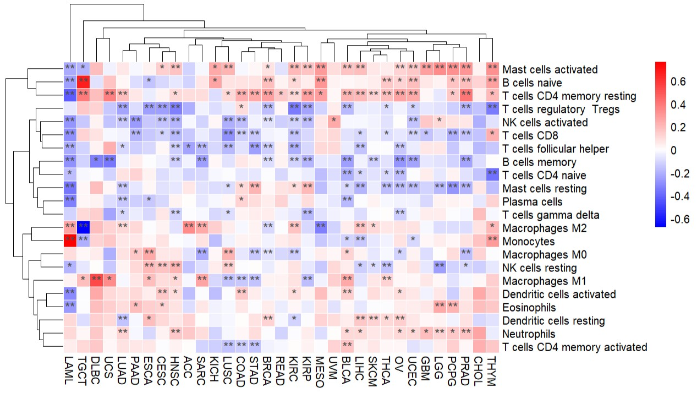

### 6.2.4.2 Genset based pan-cancer correlation with immune score 

#### `gs_immunescore_heatmap`

Create a pan-cancer heatmap with symbols indicating statistical significance to reveal the correlation between the expression of a geneset and immune scores, including Stromal score, immune score, and ESTIMATE score.

```r
gs_immunescore_heatmap(geneset,method="pearson",lowcol="blue",highcol="red",cluster_row=T,cluster_col=T,legend=T)
```

### Arguments

**geneset**

geneset name likes "ALONSO_METASTASIS_EMT_DN" or a character vector like c("KLF4","KLF7").

**method**

method="pearson" is the default value. The alternatives to be passed to correlation are "spearman" and "kendall".

**lowcol**

 color for low point.

**highcol**

color for high point.

**cluster_row**

boolean values determining if rows should be clustered or hclust object.

**cluster_col**

boolean values determining if columns should be clustered or hclust object.

**legend**

 logical to determine if legend should be drawn or not.

**Example**

```r
gs_immunescore_heatmap("ALONSO_METASTASIS_EMT_DN")
```

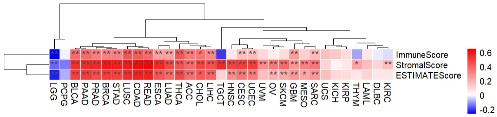

## 6.3 Genset based pan-cancer Cox regression analysis

### 6.3.1 Genset based pan-cancer Cox regression forest plot

#### `gs_pan_forest`

Create a pan-cancer Cox regression forest plot for a geneset.

```r
gs_pan_forest(geneset,geneset_alias,adjust=F)
```

### Arguments

**geneset**

geneset name likes "ALONSO_METASTASIS_EMT_DN" or a character vector like c("KLF4","KLF7").

**geneset_alias**

geneset alias name for plotting likes "METASTASIS EMT".

**adjust **

adjust whether the Cox regression analysis was adjusted by age and stage. adjust=F is the default value.

**Example**

```r
gs_pan_forest("ALONSO_METASTASIS_EMT_DN","METASTASIS EMT")
```

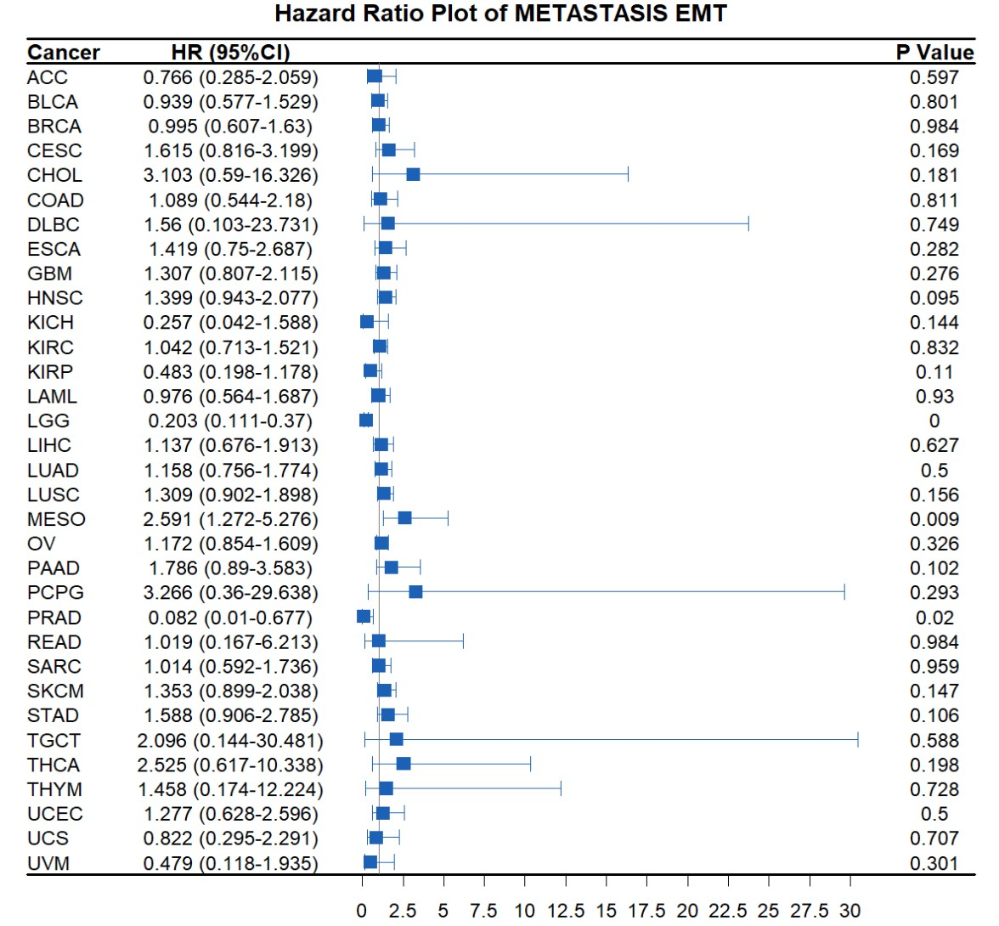

## 6.4 Genset based cancer type specific analysis

## 6.4.1 Genset based cancer type specific expression analysis

### 6.4.1.1 Genset based expression analysis grouped by clinical information

#### 5.4.1.1.1 Genset based tumor-normal boxplot

#### `gs_boxplot`

Create a tumor-normal box plot for a geneset in a specific type of cancer.

```r
gs_boxplot(cancer,geneset,geneset_alias,add = "jitter",
                    palette="jco",legend="none",label="p.signif",method="wilcox.test")
```

### Arguments

**cancer**

cancer name likes "BRCA".

**geneset**

geneset name likes "ALONSO_METASTASIS_EMT_DN" or a character vector like c("KLF4","KLF7").

**geneset_alias**

geneset alias name for plotting likes "METASTASIS EMT".

**add**

character vector for adding another plot element likes "none", "dotplot", "jitter".

**palette**

the color palette to be used for coloring or filling by groups. Allowed values include scientific journal palettes from ggsci R package, e.g.: "npg", "aaas", "lancet", "jco".

**legend**

legend position. Allowed values include "top","bottom","left","right" and "none".

**label**

character string specifying label type. Allowed values include "p.signif" (shows the significance levels), "p.format" (shows the formatted p value). label="p.signif" is default.

**method**

a character string indicating which method to be used for comparing means including "wilcox.text" and "t.test". method="wilcox.test" is default.

**Example**

```r
gs_boxplot("BRCA","ALONSO_METASTASIS_EMT_DN","METASTASIS EMT")
```

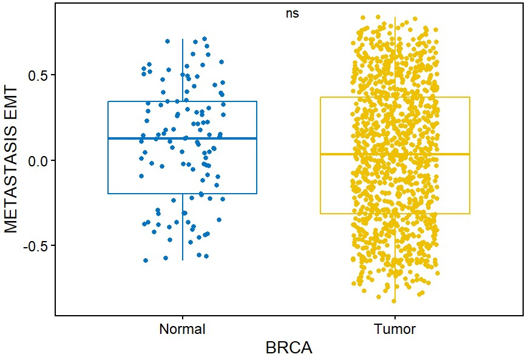

#### 6.4.1.1.2 Genset based paired tumor-normal boxplot

#### `gs_paired_boxplot`

Create a paired tumor-normal box plot for a geneset in a specific type of cancer. Only cancers with more than 20 paired samples could be analyzed, including "BLCA","BRCA","COAD","ESCA","HNSC","KICH","KIRC","KIRP","LIHC","LUAD","LUSC","PRAD","STAD","THCA", and "UCEC".

```r
gs_paired_boxplot(cancer,geneset,geneset_alias, palette="jco",legend="none",label="p.signif",method="wilcox.test")
```

### Arguments

**cancer**

cancer name likes "BRCA".

**geneset**

geneset name likes "ALONSO_METASTASIS_EMT_DN" or a character vector like c("KLF4","KLF7").

**geneset_alias**

geneset alias name for plotting likes "METASTASIS EMT".

**palette**

the color palette to be used for coloring or filling by groups. Allowed values include scientific journal palettes from ggsci R package, e.g.: "npg", "aaas", "lancet", "jco".

**legend**

legend position. Allowed values include "top","bottom","left","right" and "none".

**label**

character string specifying label type. Allowed values include "p.signif" (shows the significance levels), "p.format" (shows the formatted p value). label="p.signif" is default.

**method**

a character string indicating which method to be used for comparing means including "wilcox.text" and "t.test". method="wilcox.test" is default.

**Example**

```r
gs_paired_boxplot("BRCA","ALONSO_METASTASIS_EMT_DN","METASTASIS EMT")
```

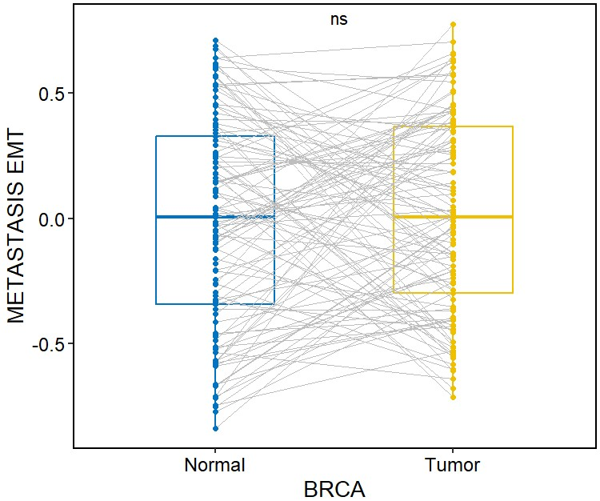

#### 6.4.1.1.3 Age grouped boxplot

#### `gs_age`

 Create a box plot for a geneset grouped by age in a specific type of cancer.

```r
gs_age(cancer,geneset,geneset_alias,age=60,add = "jitter",palette="jco",legend="none",label="p.signif",method="wilcox.test")
```

### Arguments

**cancer**

cancer name likes "ACC".

**geneset**

geneset name likes "ALONSO_METASTASIS_EMT_DN" or a character vector like c("KLF4","KLF7").

**geneset_alias**

geneset alias name for plotting likes "METASTASIS EMT".

**age**

numeric number of age like 60.

**add**

character vector for adding another plot element likes "none", "dotplot", "jitter".

**palette**

the color palette to be used for coloring or filling by groups. Allowed values include scientific journal palettes from ggsci R package, e.g.: "npg", "aaas", "lancet", "jco".

**legend**

legend position. Allowed values include "top","bottom","left","right" and "none".

**label**

character string specifying label type. Allowed values include "p.signif" (shows the significance levels), "p.format" (shows the formatted p value). label="p.signif" is default.

**method**

a character string indicating which method to be used for comparing means including "wilcox.text" and "t.test". method="wilcox.test" is default.

**Example**

```r
gs_age("COAD","ALONSO_METASTASIS_EMT_DN","METASTASIS EMT")
```

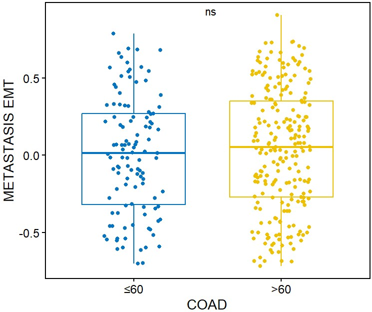

#### `gs_3age`

Create a box plot for a geneset grouped by three age groups in a specific type of cancer.

```r
gs_3age(cancer,geneset,geneset_alias,age1=40,age2=60,add = "jitter",palette="jco",legend="none",label="p.signif",method="wilcox.test")
```

### Arguments

**cancer**

cancer name likes "ACC".

**geneset**

geneset name likes "ALONSO_METASTASIS_EMT_DN" or a character vector like c("KLF4","KLF7").

**geneset_alias**

geneset alias name for plotting likes "METASTASIS EMT".

**age1**

numeric number of young age like 40.

**age2**

numeric number of old age like 60.

**add**

character vector for adding another plot element likes "none", "dotplot", "jitter".

**palette**

the color palette to be used for coloring or filling by groups. Allowed values include scientific journal palettes from ggsci R package, e.g.: "npg", "aaas", "lancet", "jco".

**legend**

legend position. Allowed values include "top","bottom","left","right" and "none".

**legend**

legend position. Allowed values include "top","bottom","left","right" and "none".

**label**

character string specifying label type. Allowed values include "p.signif" (shows the significance levels), "p.format" (shows the formatted p value). label="p.signif" is default.

**method**

a character string indicating which method to be used for comparing means including "wilcox.text" and "t.test". method="wilcox.test" is default.

**Example**

```r
gs_3age("COAD","ALONSO_METASTASIS_EMT_DN","METASTASIS EMT")
```

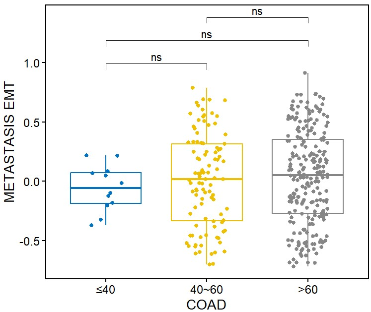

#### 6.4.1.1.4 Genset based gender grouped boxplot

#### `gs_gender`

Create a box plot for a single gene with symbols indicating statistical significance grouped by gender in a specific type of cancer.

```r
gs_gender(cancer,geneset,geneset_alias,add = "jitter",palette="jco",legend="none",label="p.signif",method="wilcox.test")
```

### Arguments

**cancer**

cancer name likes "BLCA".

**geneset**

geneset name likes "ALONSO_METASTASIS_EMT_DN" or a character vector like c("KLF4","KLF7").

**geneset_alias**

geneset alias name for plotting likes "METASTASIS EMT".

**add**

character vector for adding another plot element likes "none", "dotplot", "jitter".

**palette**

the color palette to be used for coloring or filling by groups. Allowed values include scientific journal palettes from ggsci R package, e.g.: "npg", "aaas", "lancet", "jco".

**legend**

legend position. Allowed values include "top","bottom","left","right" and "none".

**label**

character string specifying label type. Allowed values include "p.signif" (shows the significance levels), "p.format" (shows the formatted p value). label="p.signif" is default.

**method**

a character string indicating which method to be used for comparing means including "wilcox.text" and "t.test". method="wilcox.test" is default.

**Example**

```r
gs_gender("COAD","ALONSO_METASTASIS_EMT_DN","METASTASIS EMT")
```

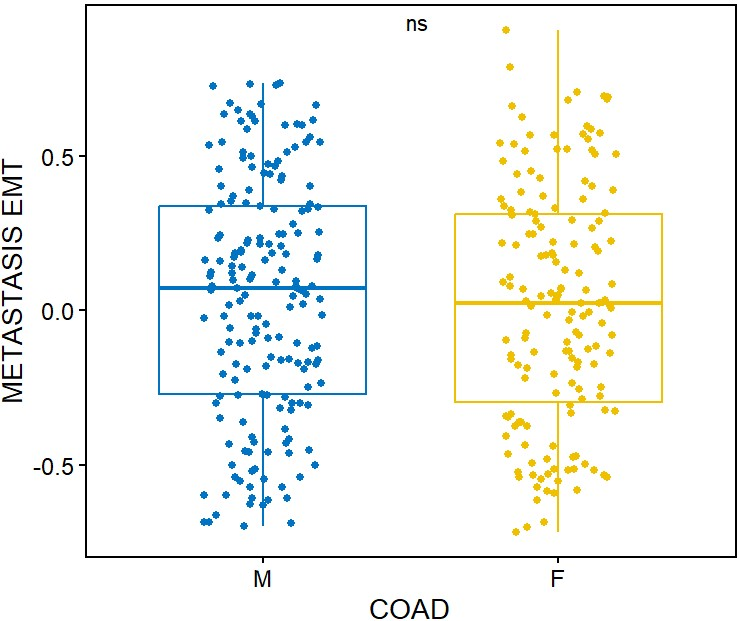

#### 6.4.1.1.5 Geneset based stage grouped boxplot

#### `gs_stage`

Create a box plot for a single gene with symbols indicating statistical significance grouped by stage in a specific type of cancer.

```r
gs_stage(cancer,geneset,geneset_alias,add = "jitter",palette="jco",legend="none",label="p.signif",method="wilcox.test")
```

### Arguments

**cancer**

cancer name likes "COAD".

**geneset**

geneset name likes "ALONSO_METASTASIS_EMT_DN" or a character vector like c("KLF4","KLF7").

**geneset_alias**

geneset alias name for plotting likes "METASTASIS EMT".

**add**

character vector for adding another plot element likes "none", "dotplot", "jitter".

**palette**

the color palette to be used for coloring or filling by groups. Allowed values include scientific journal palettes from ggsci R package, e.g.: "npg", "aaas", "lancet", "jco".

**legend**

legend position. Allowed values include "top","bottom","left","right" and "none".

**label**

character string specifying label type. Allowed values include "p.signif" (shows the significance levels), "p.format" (shows the formatted p value). label="p.signif" is default.

**method**

a character string indicating which method to be used for comparing means including "wilcox.text" and "t.test". method="wilcox.test" is default.

**Example**

```r
gs_stage("COAD","ALONSO_METASTASIS_EMT_DN","METASTASIS EMT")
```

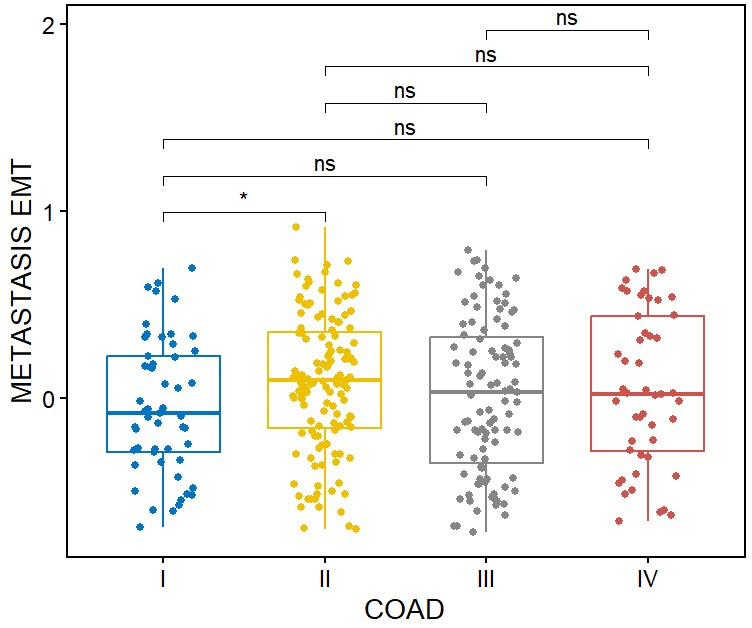

## 6.4.2 Geneset based diagnostic ROC Curve

#### `gs_roc`

Diagnostic ROC curve of a geneset in a specific type of cancer.

```r
gs_roc(cancer,geneset,geneset_alias)
```

### Arguments

**cancer**

cancer name likes "BRCA".

**geneset**

geneset name likes "ALONSO_METASTASIS_EMT_DN" or a character vector like c("KLF4","KLF7").

**geneset_alias**

geneset alias name for plotting likes "METASTASIS EMT".

**add**

**Example**

```r
gs_roc("BRCA","ALONSO_METASTASIS_EMT_DN","METASTASIS EMT")
```

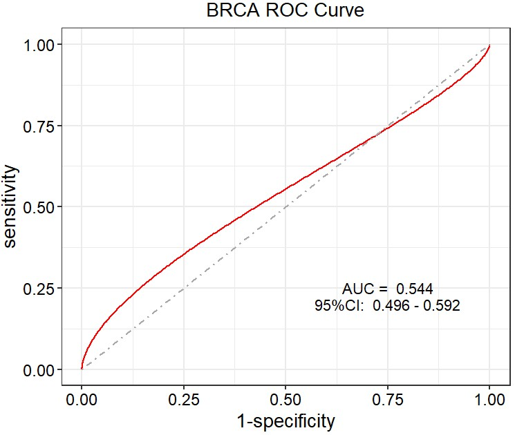

## 6.4.3 Geneset based survavial analysis

#### `gs_kmplot`

 K_M survival plot for a geneset in a specific type of cancer.

```r
gs_kmplot(cancer,geneset,geneset_alias,palette='jco')
```

### Arguments

**cancer**

cancer name likes "COAD".

**geneset**

geneset name likes "ALONSO_METASTASIS_EMT_DN" or a character vector like c("KLF4","KLF7").

**geneset_alias**

geneset alias name for plotting likes "METASTASIS EMT".

**palette** the color palette to be used for coloring or filling by groups. Allowed values include scientific journal palettes from ggsci R package, e.g.: "npg", "aaas", "lancet", "jco".

**Example**

```r
gs_kmplot("COAD","ALONSO_METASTASIS_EMT_DN","METASTASIS EMT")
```

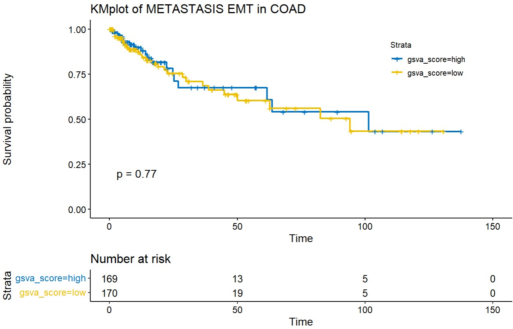

# 7. Built-in data extraction

## 7.1 TPM matrix extraction

#### `get_all_tpm`

Extract the whole TPM matrix of all types of cancer in TCGA.

```r
get_all_tpm()
```

#### `get_tpm`

Extract the TPM matrix of a specific type of cancer in TCGA.


```r
get_tpm(cancer)
```

### Arguments

**cancer**

cancer name likes "COAD".

**Example**


```r
get_tpm("COAD")

#>                  Cancer Group TSPAN6 TNMD DPM1 SCYL3 C1orf112  FGR  CFH FUCA2
#> TCGA-CM-4743-01A   COAD Tumor   4.83 0.00 6.54  1.92     1.50 2.72 3.82  6.05
#> TCGA-D5-6931-01A   COAD Tumor   6.58 1.73 6.70  3.26     3.42 3.11 3.97  6.31
#> TCGA-AA-A00A-01A   COAD Tumor   5.93 1.03 6.20  2.90     2.12 2.99 3.24  6.82
#> TCGA-AD-A5EK-01A   COAD Tumor   7.36 0.47 8.03  2.75     2.75 1.51 2.26  6.35
#> TCGA-A6-2680-01A   COAD Tumor   6.90 1.73 6.66  2.55     3.01 2.79 2.88  6.02
```

## 7.2 Paired TPM matrix extraction

#### `get_all_paired_tpm`

Extract the whole TPM matrix of all types of cancer with paired samples (n>20) in TCGA.

```r
get_all_paired_tpm()
```

#### `get_paired_tpm`

Extract the TPM matrix of a specific type of cancer with paired samples (n\>20) in TCGA.


```r
get_paired_tpm(cancer)
```

### Arguments

**cancer**

cancer name likes "COAD".

**Example**


```r
get_paired_tpm("COAD")

#>                  Cancer Group TSPAN6 TNMD DPM1 SCYL3 C1orf112  FGR  CFH FUCA2
#> TCGA-CM-4743-01A   COAD Tumor   4.83 0.00 6.54  1.92     1.50 2.72 3.82  6.05
#> TCGA-D5-6931-01A   COAD Tumor   6.58 1.73 6.70  3.26     3.42 3.11 3.97  6.31
#> TCGA-AA-A00A-01A   COAD Tumor   5.93 1.03 6.20  2.90     2.12 2.99 3.24  6.82
#> TCGA-AD-A5EK-01A   COAD Tumor   7.36 0.47 8.03  2.75     2.75 1.51 2.26  6.35
#> TCGA-A6-2680-01A   COAD Tumor   6.90 1.73 6.66  2.55     3.01 2.79 2.88  6.02
```

## 7.3 Clinical information extraction

#### `get_all_meta`

Extract the clinical information of all types of cancer in TCGA.

```r
get_all_meta()
```

#### `get_meta`

Extract the clinical information of a specific type of cancer in TCGA.


```r
get_meta(cancer)
```

### Arguments

**cancer**

cancer name likes "COAD".

**Example**


```r
get_meta("COAD")

#>              Cancer event   time age gender stage
#> TCGA-3L-AA1B   COAD     0   5.13  61      F     I
#> TCGA-4N-A93T   COAD     0   0.27  67      M   III
#> TCGA-4T-AA8H   COAD     0   5.33  42      F    II
#> TCGA-5M-AAT4   COAD     1   1.63  74      M    IV
#> TCGA-5M-AAT6   COAD     1   9.67  41      F    IV
#> TCGA-5M-AATE   COAD     0  40.00  76      M    II
#> TCGA-A6-2671   COAD     0  21.60  86      M    IV

```

## 7.4 TMB extraction

#### `get_tmb`

Extract the TMB matrix of all samples in TCGA.


```r
get_tmb()
```

**Example**


```r
get_tmb()

#>                     TMB
#> TCGA-OR-A5J1-01A   0.70
#> TCGA-OR-A5J2-01A   0.83
#> TCGA-OR-A5J3-01A   0.27
#> TCGA-OR-A5J5-01A   8.53
#> TCGA-OR-A5J6-01A   0.77
```

## 7.5 MSI extraction

#### `get_msi`

Extract the MSI matrix of all samples in TCGA.


```r
get_msi()
```

**Example**


```r
get_msi()

#>                MSI
#> TCGA-OR-A5J1 0.275
#> TCGA-OR-A5J2 0.324
#> TCGA-OR-A5J3 0.343
#> TCGA-OR-A5J5 0.522
#> TCGA-OR-A5J6 0.289
```

## 7.6 Methylation extraction

#### `get_methy`

Show the download link of the whole methylation mtrix with 8Gb.

```r
get_methy()
```

#### `get_promoter_methy`

Extract promoter methylation information of a specific type of cancer.


```r
get_promoter_methy(cancer)
```

### Arguments

**cancer**

cancer name likes "UVM".

**Example**


```r
uvm=get_promoter_methy("UVM")
uvm$probe[1:4,1:2]
#     probe  gene
# 47  cg03586879 A2BP1
# 111 cg19378133 A2BP1
# 121 cg00336946 A2LD1
# 125 cg02923162 A2LD1

uvm$methy[1:4,1:4]
#                    Cancer cg18147296 cg13897241 cg13176867
# TCGA-WC-A87W-01A    UVM      0.872      0.465      0.357
# TCGA-V4-A9F8-01A    UVM      0.915      0.844      0.640
# TCGA-V4-A9F7-01A    UVM      0.862      0.767      0.744
# TCGA-WC-A888-01A    UVM      0.791      0.858      0.798
```

## 7.7 Immune cell ratio extraction

#### `get_immu_ratio`

Extract the immune cell ratio of all samples in TCGA.


```r
get_immu_ratio()
```

**Example**


```r
get_immu_ratio()

#>                  B cells memory B cells naive Dendritic cells activated
#> TCGA-OR-A5LD-01A         0.0069        0.0000                    0.0000
#> TCGA-OR-A5KO-01A         0.0685        0.0000                    0.0844
#> TCGA-OR-A5LA-01A         0.0000        0.0117                    0.0000
#> TCGA-OR-A5JW-01A         0.0133        0.0000                    0.0258
#> TCGA-PA-A5YG-01A         0.0085        0.0056                    0.0100
#> TCGA-OR-A5JD-01A         0.0146        0.0000                    0.0093

```

## 7.8 Immune score extraction

#### `get_immuscore`

Extract the immune score of all samples in TCGA.


```r
get_immuscore()
```

**Example**


```r
get_immuscore()

#>                  B cells memory B cells naive Dendritic cells activated
#> TCGA-OR-A5LD-01A         0.0069        0.0000                    0.0000
#> TCGA-OR-A5KO-01A         0.0685        0.0000                    0.0844
#> TCGA-OR-A5LA-01A         0.0000        0.0117                    0.0000
#> TCGA-OR-A5JW-01A         0.0133        0.0000                    0.0258
#> TCGA-PA-A5YG-01A         0.0085        0.0056                    0.0100

```

## 7.9 Geneset list extraction

#### `get_geneset`

Extract the whole built in geneset list from MSigDB.


```r
get_geneset()
```

## 7.10 Built-in data summary

#### `get_cancers`

Return the sample summary of 33 types of cancer in TCGA.


```r
get_cancers()
```

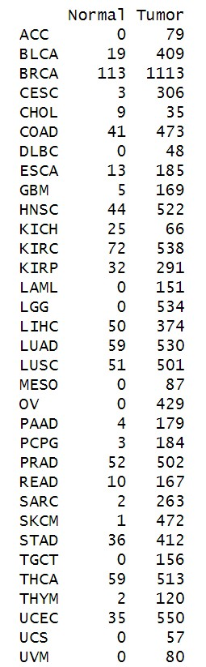

#### `get_paired_cancers`

Return the sample summary of 15 types of cancer containing more than 20 paired samples in TCGA.

```r
get_paired_cancers()
```

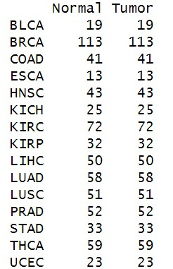

**END**

2024.10.17
