# TCGAplot 
#### <span style="color:red">(DO NOT INSTALL USING "devtools", PLEASE download the .zip file and install the package locally)</span>

**author:** Xiong Wang

**email:** wangxiong@tjh.tjmu.edu.cn

**affiliation:** Department of Laboratory Medicine, Tongji Hospital, Tongji Medical College, HUST


# 1. Introduction

Pan-cancer analysis aimed to examine the commonalities and heterogeneity among the genomic and cellular alterations across diverse types of tumors. Pan-cancer analysis of gene expression, tumor mutational burden (TMB), microsatellite instability (MSI), and tumor immune microenvironment (TIME) became available based on the exome, transcriptome, and DNA methylome data from TCGA. Some online tools provided user-friendly analysis of gene and protein expression, mutation, methylation, and survival for TCGA data, such as GEPIA 2 (<http://gepia2.cancer-pku.cn/#index>), cBioPortal (<http://www.cbioportal.org/>), UALCAN (<https://ualcan.path.uab.edu/index.html>), and MethSurv (<https://biit.cs.ut.ee/methsurv/>). However, these online tools were either uni-functional or not able to perform analysis of user-defined functions. Therefore, TCGA pan-cancer multi-omics data were integrated and included in this package, including gene expression TPM (transcripts per million) matrix, TMB, MSI, immune cell ratio, immune score, promoter methylation, and clinical information. A number of functions were generated to perform pan-cancer paired/unpaired differential gene expression analysis, pan-cancer correlation analysis between gene expression and TMB, MSI, immune cell ratio, immune score,immune stimulator,immune inhibitor, and promoter methylation. Methods for visualization were provided, including paired/unpaired boxplot, survival plot, ROC curve, heatmap, scatter, radar chart, and forest plot,in order to easily perform integrative pan-cancer multi-omics analysis. Finally, these built-in data could be extracted and analyzed with user-defined functions, making the pan-cancer analysis much more convenient.

# 2. Installation

To install this package, download TCGAplot R package at [https://github.com/tjhwangxiong/TCGAplot/releases/download/v5.0.0/TCGAplot_5.0.0.zip](https://github.com/tjhwangxiong/TCGAplot/releases/download/v5.0.0/TCGAplot_5.0.0.zip)
and install locally.

# 3. Pan-cancer analysis

## 3.1 Pan-cancer expression analysis

### 3.1.1 Pan-cancer tumor-normal boxplot

#### `pan_boxplot`

Create a pan-cancer box plot for a single gene with symbols indicating statistical significance.


```r
pan_boxplot(gene,palette="jco",legend="right")
```

### Arguments

**gene**

gene name likes "KLF7".

**palette**

the color palette to be used for filling by groups. Allowed values include scientific journal palettes from ggsci R package, e.g.: "npg", "aaas", "lancet", "jco", "ucscgb", "uchicago", "simpsons" and "rickandmorty".

**legend**

legend position. Allowed values include "top","bottom","left","right" and "none".

**Example**


```r
pan_boxplot("KLF7")
```
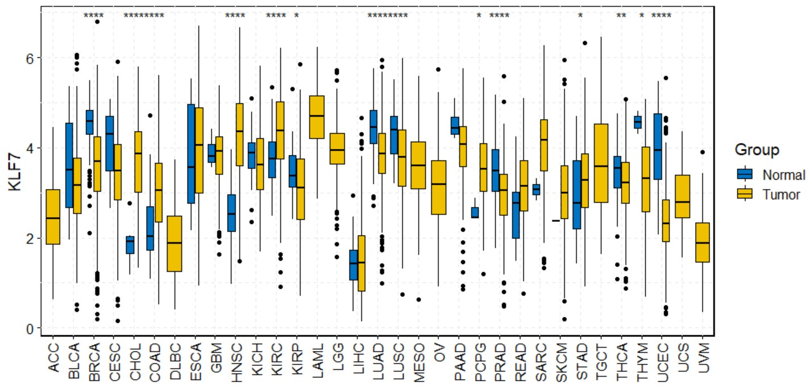

### 3.1.2 Pan-cancer paired tumor-normal boxplot

#### `pan_paired_boxplot`

Create a pan-cancer paired box plot for a single gene with symbols indicating statistical significance.


```r
pan_paired_boxplot(gene,palette="jco",legend="right")
```

### Arguments

**gene**

gene name likes "KLF7".

**palette**

the color palette to be used for filling by groups. Allowed values include scientific journal palettes from ggsci R package, e.g.: "npg", "aaas", "lancet", "jco", "ucscgb", "uchicago", "simpsons" and "rickandmorty".

**legend**

legend position. Allowed values include "top","bottom","left","right" and "none".

**Example**


```r
pan_paired_boxplot("KLF7")
```
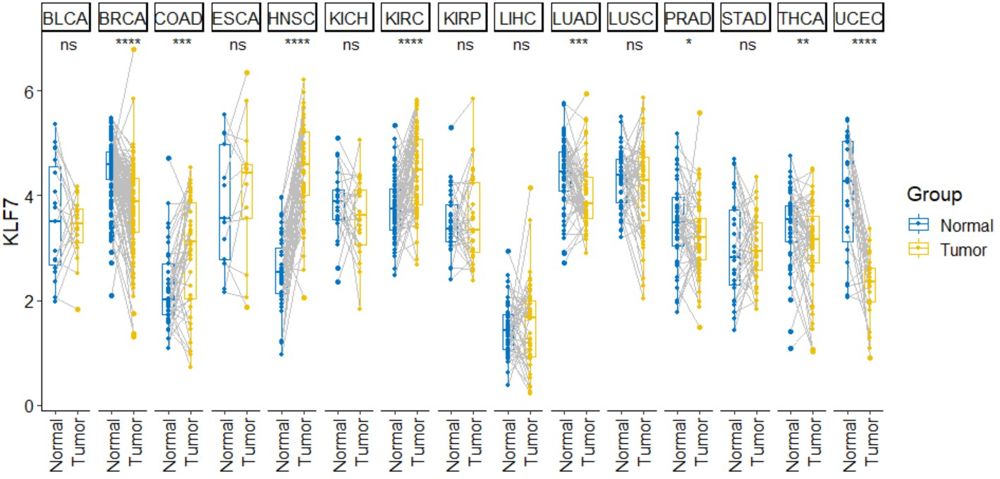

## 3.2 Pan-cancer correlation analysis

### 3.2.1 Pan-cancer gene expression and TMB correlation radar chart

#### `gene_TMB_radar`

Create a pan-cancer radar chart for gene expression and TMB correlation.


```r
gene_TMB_radar(gene,method = "pearson")
```

### Arguments

**gene**

gene name likes "KLF7".

**method**

method="pearson" is the default value. The alternatives to be passed to correlation are "spearman" and "kendall".

**Example**


```r
gene_TMB_radar("KLF7")
```
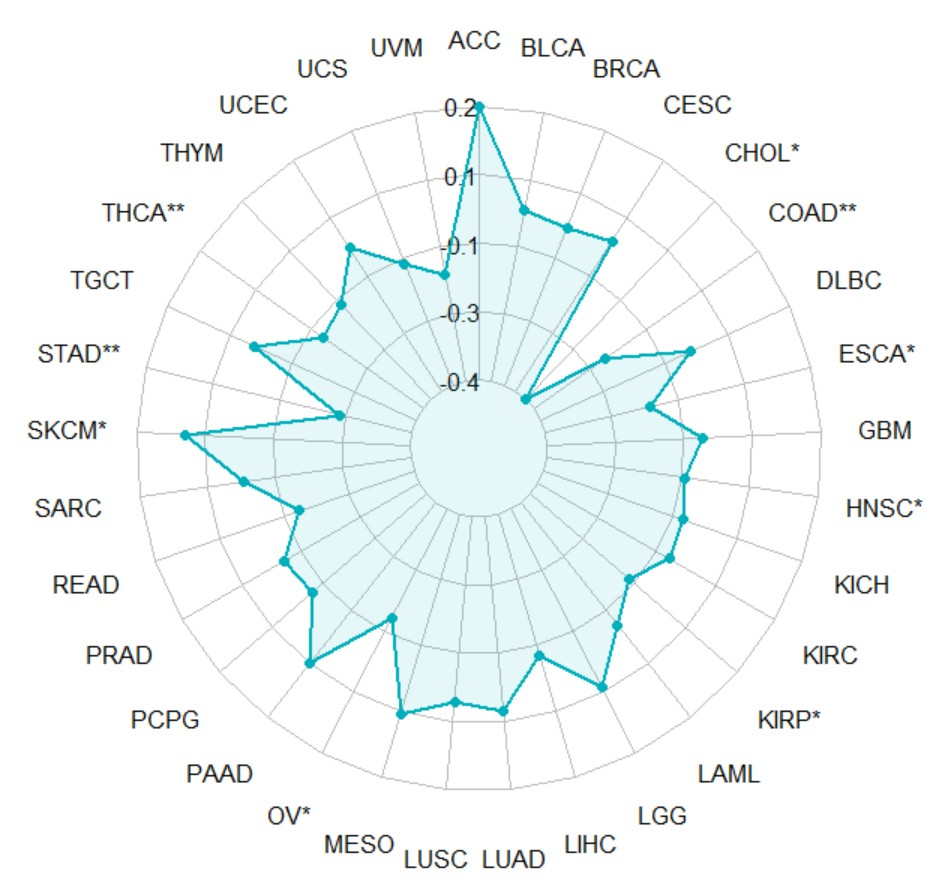

### 3.2.2 Pan-cancer gene expression and MSI correlation radar chart

#### `gene_MSI_radar`

Create a pan-cancer radar chart for gene expression and MSI correlation.


```r
gene_MSI_radar(gene,method = "pearson")
```

### Arguments

**gene** gene name likes "KLF7".

**method**

method="pearson" is the default value. The alternatives to be passed to correlation are "spearman" and "kendall".

**Example**


```r
gene_MSI_radar("KLF7")
```
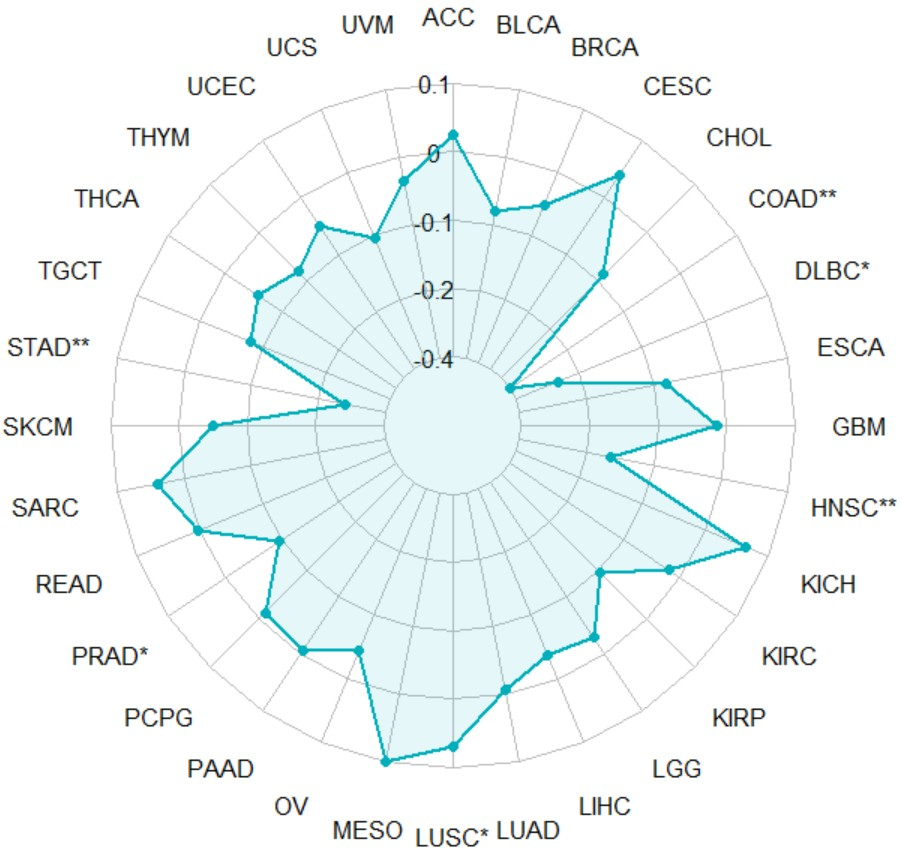

### 3.2.3 Pan-cancer gene expression and immune-related genes correlation

### 3.2.3.1 Pan-cancer gene expression and ICGs correlation

#### `gene_checkpoint_heatmap`

Create a pan-cancer heatmap with symbols indicating statistical significance to reveal the correlation between the expression of a single gene and ICGs (immune checkpoint genes).

ICGs geneset included "CD274","CTLA4","HAVCR2","LAG3","PDCD1","PDCD1LG2","SIGLEC15",and "TIGIT".


```r
gene_checkpoint_heatmap(gene,method="pearson")
```

### Arguments

**gene**

gene name likes "KLF7".

**method**

method="pearson" is the default value. The alternatives to be passed to correlation are "spearman" and "kendall".

**Example**


```r
gene_checkpoint_heatmap("KLF7")
```
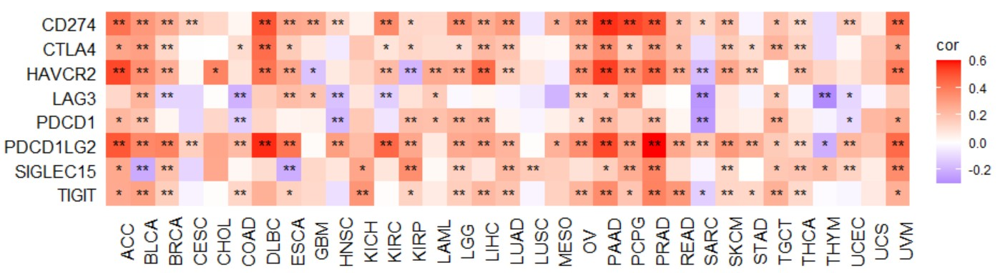

### 3.2.3.2 Pan-cancer gene expression and chemokine correlation

#### `gene_chemokine_heatmap`

Create a pan-cancer heatmap with symbols indicating statistical significance to reveal the correlation between the expression of a single gene and chemokine.

Chemokine geneset included "CCL1","CCL2","CCL3","CCL4","CCL5","CCL7","CCL8","CCL11","CCL13","CCL14","CCL15","CCL16","CCL17","CCL18","CCL19","CCL20","CCL21","CCL22","CCL23","CCL24","CCL25","CCL26","CCL28","CX3CL1","CXCL1","CXCL2","CXCL3","CXCL5","CXCL6","CXCL8","CXCL9","CXCL10","CXCL11","CXCL12","CXCL13","CXCL14","CXCL16", and "CXCL17".


```r
gene_chemokine_heatmap(gene,method="pearson")
```

### Arguments

**gene**

gene name likes "KLF7".

**method**

method="pearson" is the default value. The alternatives to be passed to correlation are "spearman" and "kendall".

**Example**


```r
gene_chemokine_heatmap("KLF7")
```
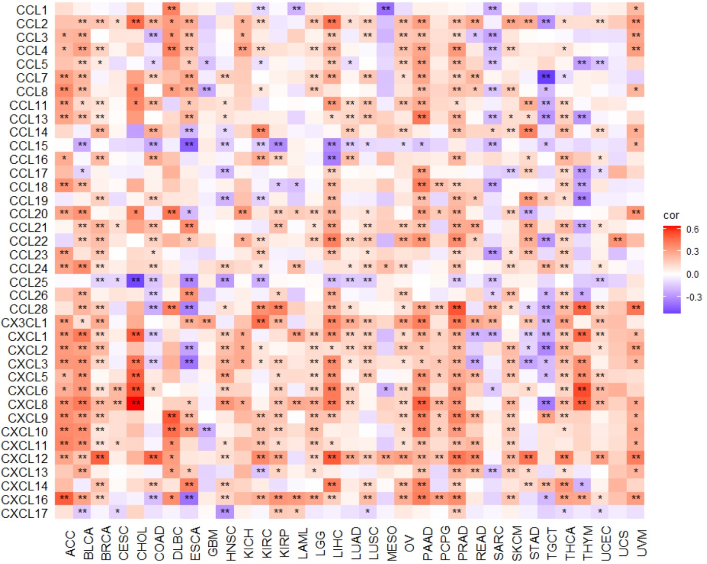

### 3.2.3.3 Pan-cancer gene expression and chemokine receptor correlation

#### `gene_receptor_heatmap`

Create a pan-cancer heatmap with symbols indicating statistical significance to reveal the correlation between the expression of a single gene and chemokine receptors.

Chemokine receptor geneset included "CCR1","CCR2","CCR3","CCR4","CCR5","CCR6","CCR7","CCR8","CCR9","CCR10", "CXCR1","CXCR2","CXCR3","CXCR4","CXCR5","CXCR6","XCR1", and "CX3R1".


```r
gene_receptor_heatmap(gene,method="pearson")
```

### Arguments

**gene**

gene name likes "KLF7".

**method**

method="pearson" is the default value. The alternatives to be passed to correlation are "spearman" and "kendall".

**Example**


```r
gene_receptor_heatmap("KLF7")
```
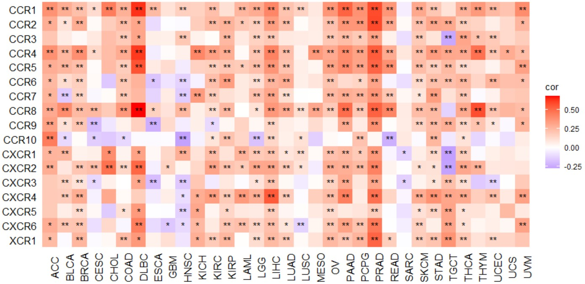

### 3.2.3.4 Pan-cancer gene expression and immune stimulator correlation

#### `gene_immustimulator_heatmap`

Create a pan-cancer heatmap with symbols indicating statistical significance to reveal the correlation between the expression of a single gene and immune stimulators.

Immune stimulator geneset included "CD27","CD276","CD28","CD40","CD40LG","CD48","CD70","CD80","CD86","CXCL12","CXCR4","ENTPD1","HHLA2","ICOS","ICOSLG","IL2RA","IL6","IL6R","KLRC1","KLRK1","LTA","MICB","NT5E","PVR","RAET1E","TMIGD2","TNFRSF13B","TNFRSF13C","TNFRSF14","TNFRSF17","TNFRSF18","TNFRSF25","TNFRSF4","TNFRSF8","TNFRSF9","TNFSF13","TNFSF13B","TNFSF14","TNFSF15","TNFSF18","TNFSF4","TNFSF9", and "ULBP1".


```r
gene_immustimulator_heatmap(gene,method="pearson")
```

### Arguments

**gene**

gene name likes "KLF7".

**method**

method="pearson" is the default value. The alternatives to be passed to correlation are "spearman" and "kendall".

**Example**


```r
gene_immustimulator_heatmap("KLF7")
```
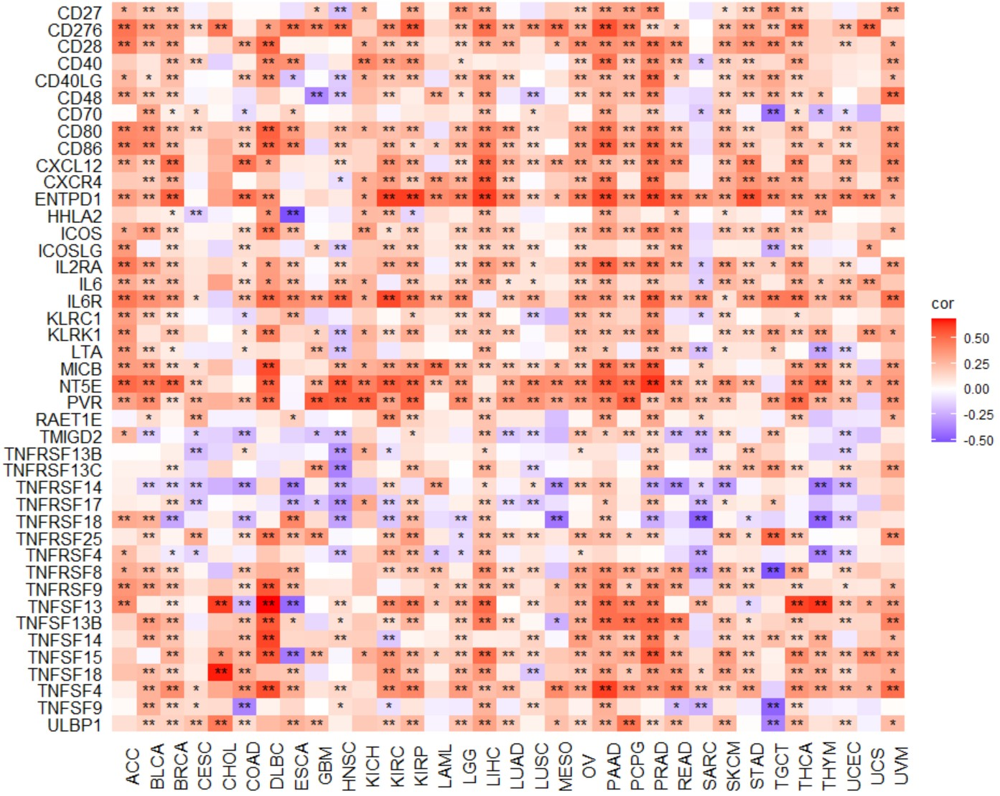

### 3.2.3.5 Pan-cancer gene expression and immune inhibitor correlation

#### `gene_immuinhibitor_heatmap`

Create a pan-cancer heatmap with symbols indicating statistical significance to reveal the correlation between the expression of a single gene and immune inhibitors.

Immune inhibitor geneset included "ADORA2A","BTLA","CD160","CD244","CD274","CD96","CSF1R","CTLA4","HAVCR2","IDO1","IL10","IL10RB","KDR","KIR2DL1","KIR2DL3","LAG3","LGALS9","PDCD1","PDCD1LG2","TGFB1","TGFBR1","TIGIT", and "VTCN1".


```r
gene_immuinhibitor_heatmap(gene,method="pearson")
```

### Arguments

**gene**

gene name likes "KLF7".

**method**

method="pearson" is the default value. The alternatives to be passed to correlation are "spearman" and "kendall".

**Example**


```r
gene_immuinhibitor_heatmap("KLF7")
```
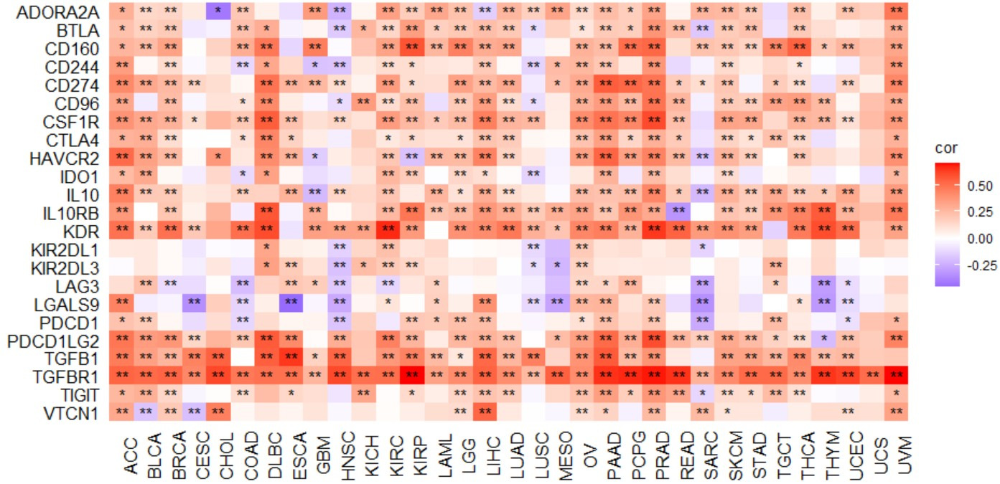

### 3.2.4 Pan-cancer gene expression and immune infiltration correlation

### 3.2.4.1 Pan-cancer gene expression and immune cell ratio correlation

#### `gene_immucell_heatmap`

Create a pan-cancer heatmap with symbols indicating statistical significance to reveal the correlation between the expression of a single gene and immune cell ratio.


```r
gene_immucell_heatmap(gene,method="pearson")
```

### Arguments

**gene**

gene name likes "KLF7".

**method**

method="pearson" is the default value. The alternatives to be passed to correlation are "spearman" and "kendall".

**Example**


```r
gene_immucell_heatmap("KLF7")
```
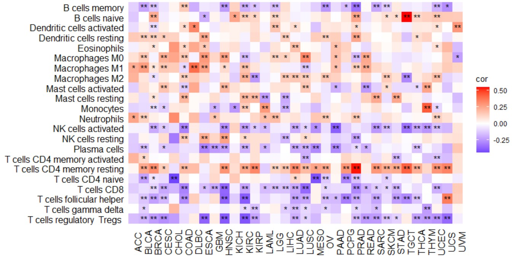

### 3.2.4.2 Pan-cancer gene expression and immune score correlation

#### `gene_immunescore_heatmap`

Create a pan-cancer heatmap with symbols indicating statistical significance to reveal the correlation between the expression of a single gene and immune scores, including Stromal score, immune score, and ESTIMATE score.


```r
gene_immunescore_heatmap(gene,method="pearson")
```

### Arguments

**gene**

gene name likes "KLF7".

**method**

method="pearson" is the default value. The alternatives to be passed to correlation are "spearman" and "kendall".

**Example**


```r
gene_immunescore_heatmap("KLF7")
```
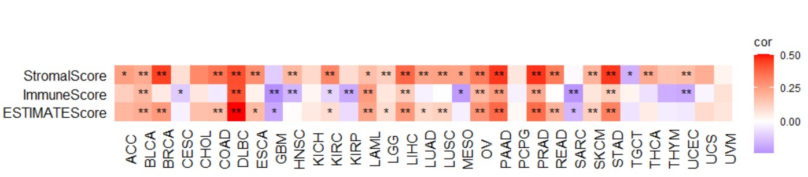

#### `gene_immunescore_triangle`

Create a pan-cancer triangle reveals the correlation between the expression of a single gene and immune scores, including Stromal score, immune score, and ESTIMATE score.


```r
gene_immunescore_triangle(gene,method="pearson")
```

### Arguments

**gene**

gene name likes "KLF7".

**method**

method="pearson" is the default value. The alternatives to be passed to correlation are "spearman" and "kendall".

**Example**


```r
gene_immunescore_triangle("KLF7")
```
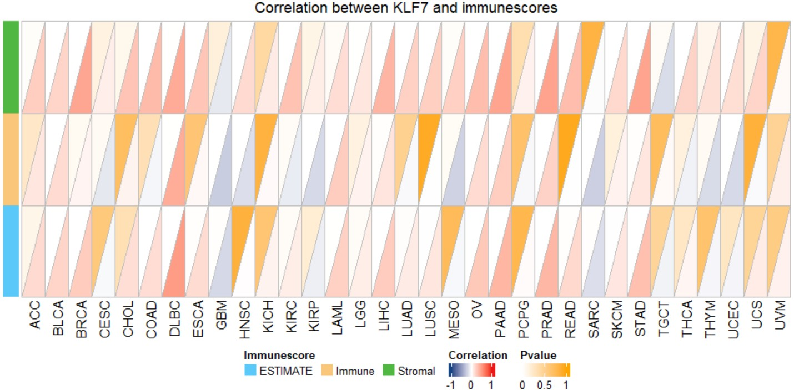

## 3.3 Pan-cancer Cox regression analysis

### 3.3.1 Pan-cancer Cox regression forest plot

#### `pan_forest`

Create a pan-cancer Cox regression forest plot for a specific gene.


```r
pan_forest(gene)
```

### Arguments

**gene**

gene name likes "KLF7".

**method**

method="pearson" is the default value. The alternatives to be passed to correlation are "spearman" and "kendall".

**Example**


```r
pan_forest("KLF7")
```
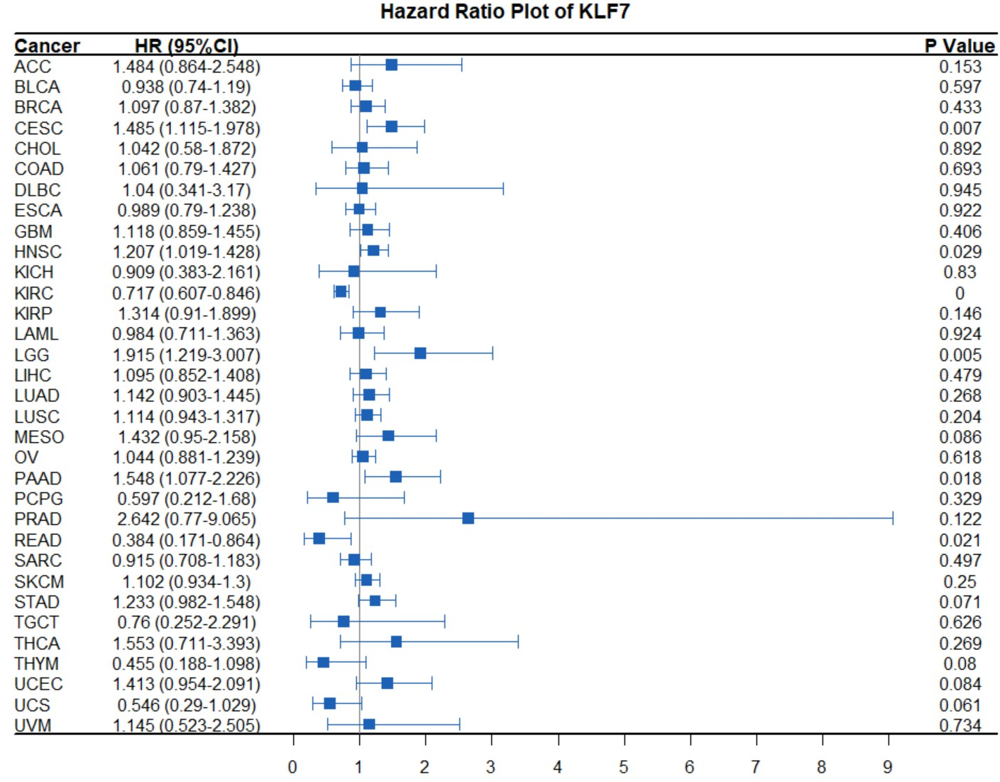

# 4. Cancer type specific analysis

## 4.1 Expression analysis

### 4.1.1 Expression analysis grouped by clinical information

#### 4.1.1.1 Tumor-normal boxplot

#### `tcga_boxplot`

Create a tumor-normal box plot for a single gene with symbols indicating statistical significance in a specific type of cancer.


```r
tcga_boxplot(cancer,gene,add = "jitter",palette="jco",legend="none")
```

### Arguments

**cancer**

cancer name likes "BRCA".

**gene**

gene name likes "KLF7".

**add**

character vector for adding another plot element likes "none", "dotplot", "jitter".

**palette**

the color palette to be used for coloring or filling by groups. Allowed values include scientific journal palettes from ggsci R package, e.g.: "npg", "aaas", "lancet", "jco".

**legend**

legend position. Allowed values include "top","bottom","left","right" and "none".

**Example**


```r
tcga_boxplot("BRCA","KLF7")
```
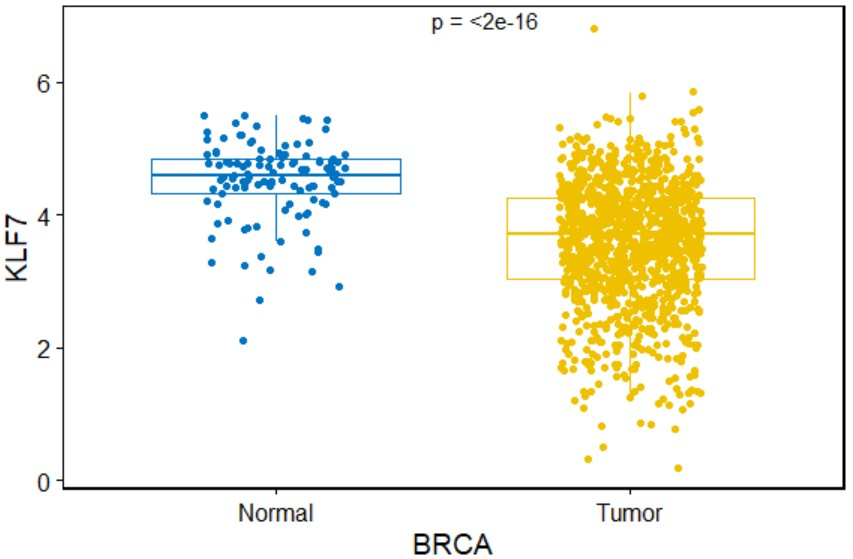

#### 4.1.1.2 Paired tumor-normal boxplot

#### `paired_boxplot`

Create a paired tumor-normal box plot for a single gene with symbols indicating statistical significance in a specific type of cancer.

Only cancers with more than 20 paired samples could be analyzed, including "BLCA","BRCA","COAD","ESCA","HNSC","KICH","KIRC","KIRP","LIHC","LUAD","LUSC","PRAD","STAD","THCA", and "UCEC".


```r
paired_boxplot(cancer,gene,palette="jco",legend="none")
```

### Arguments

**cancer**

cancer name likes "BRCA".

**gene**

gene name likes "KLF7".

**palette**

the color palette to be used for coloring or filling by groups. Allowed values include scientific journal palettes from ggsci R package, e.g.: "npg", "aaas", "lancet", "jco".

**legend**

legend position. Allowed values include "top","bottom","left","right" and "none".

**Example**


```r
paired_boxplot("BRCA","KLF7")
```
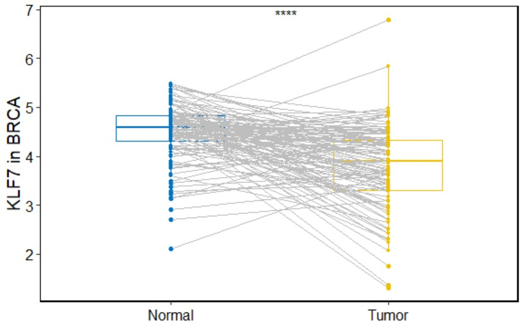

#### 4.1.1.3 Age grouped boxplot

#### `gene_age`

Create a box plot for a single gene with symbols indicating statistical significance grouped by age in a specific type of cancer.


```r
gene_age(cancer,gene,age=60,add = "jitter",palette="jco",legend="none")
```

### Arguments

**cancer**

cancer name likes "ACC".

**gene**

gene name likes "KLF7".

**age**

numeric number of age like 60.

**add**

character vector for adding another plot element likes "none", "dotplot", "jitter".

**palette**

the color palette to be used for coloring or filling by groups. Allowed values include scientific journal palettes from ggsci R package, e.g.: "npg", "aaas", "lancet", "jco".

**legend**

legend position. Allowed values include "top","bottom","left","right" and "none".

**Example**


```r
gene_age("ACC","KLF7")
```
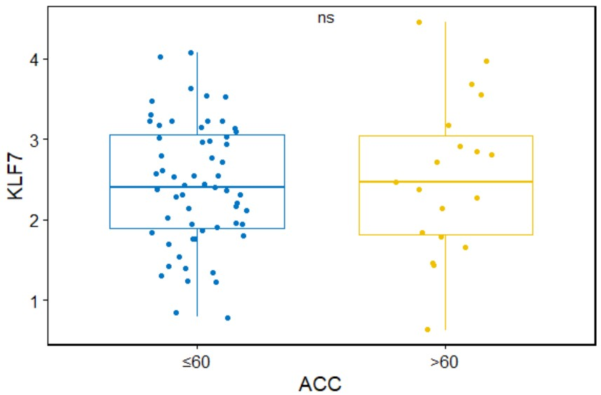

#### 4.1.1.4 Gender grouped boxplot

#### `gene_gender`

Create a box plot for a single gene with symbols indicating statistical significance grouped by gender in a specific type of cancer.


```r
gene_gender(cancer,gene,add = "jitter",palette="jco",legend="none")
```

### Arguments

**cancer**

cancer name likes "BLCA".

**gene**

gene name likes "KLF7".

**add**

character vector for adding another plot element likes "none", "dotplot", "jitter".

**palette**

the color palette to be used for coloring or filling by groups. Allowed values include scientific journal palettes from ggsci R package, e.g.: "npg", "aaas", "lancet", "jco".

**legend**

legend position. Allowed values include "top","bottom","left","right" and "none".

**Example**


```r
gene_gender("BLCA","KLF7")
```
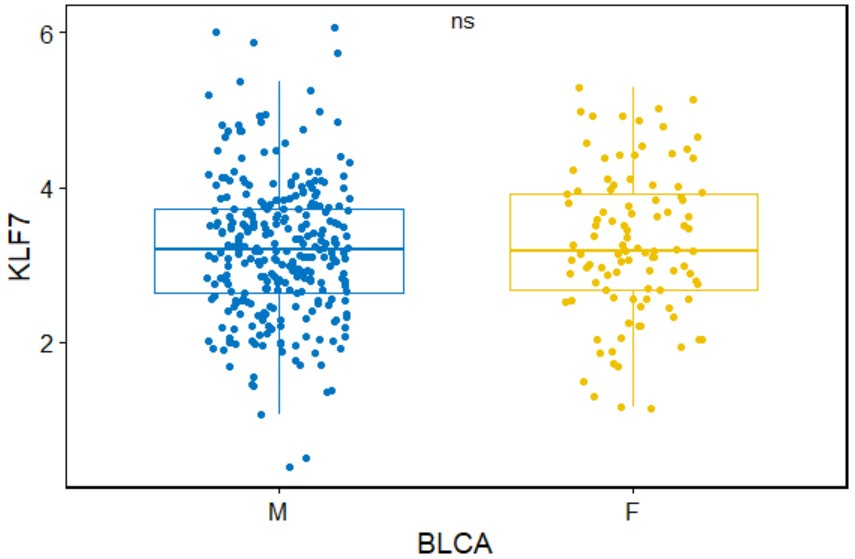

#### 4.1.1.5 Stage grouped boxplot

#### `gene_stage`

Create a box plot for a single gene with symbols indicating statistical significance grouped by stage in a specific type of cancer.


```r
gene_stage(cancer,gene,add = "jitter",palette="jco",legend="none")
```

### Arguments

**cancer**

cancer name likes "COAD".

**gene**

gene name likes "KLF7".

**add**

character vector for adding another plot element likes "none", "dotplot", "jitter".

**palette**

the color palette to be used for coloring or filling by groups. Allowed values include scientific journal palettes from ggsci R package, e.g.: "npg", "aaas", "lancet", "jco".

**legend**

legend position. Allowed values include "top","bottom","left","right" and "none".

**Example**


```r
gene_stage("COAD","KLF7")
```
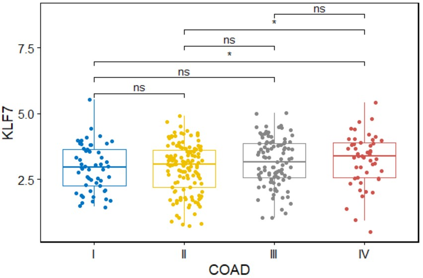

### 4.1.2 Expression analysis grouped by the expression of a spcecific gene

#### 4.1.2.1 Differential expressed gene heatmap grouped by a specific gene

#### `gene_deg_heatmap`

Create a heatmap for differentially expressed genes grouped by the expression of a single gene in a specific type of cancer.


```r
gene_deg_heatmap(cancer, gene,top_n=20)
```

### Arguments

**cancer**

cancer name likes "BLCA".

**gene**

gene name likes "KLF7".

**top_n**

the number of top DEGS to be shown in the heatmap.

**Example**


```r
gene_deg_heatmap("BLCA","KLF7")
```
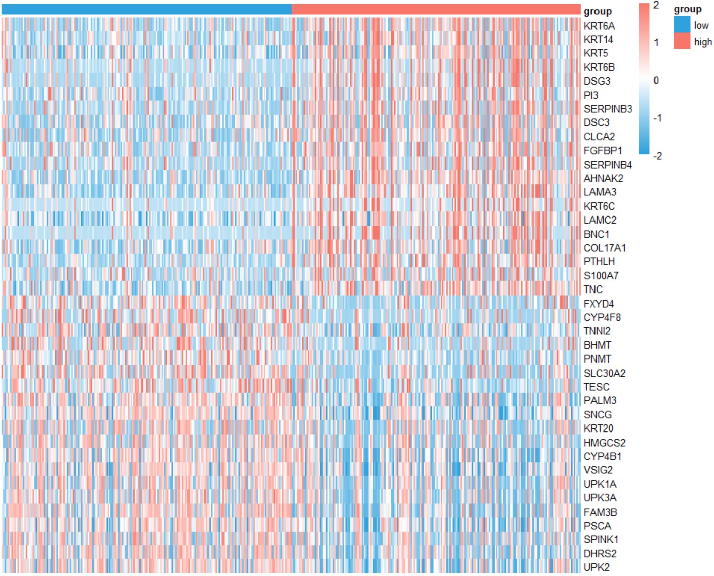

#### 4.1.2.2 GSEA-GO grouped by the expression of a spcecific gene

#### `gene_gsea_go`

GSEA-GO analysis of DEGs grouped by the expression of a single gene in a specific type of cancer, and the top 5 GO BP pathways were shown.


```r
gene_gsea_go(cancer,gene,logFC_cutoff=2,pvalue_cutoff = 0.05)
```

### Arguments

**cancer**

cancer name likes "BLCA".

**gene**

gene name likes "KLF7".

**logFC_cutoff** cutoff value of logFC, 2 was the default setting.

**pvalue_cutoff**

cutoff value of pvalue, 0.05 was the default setting.

**Example**


```r
gene_gsea_go("BLCA","KLF7")
```
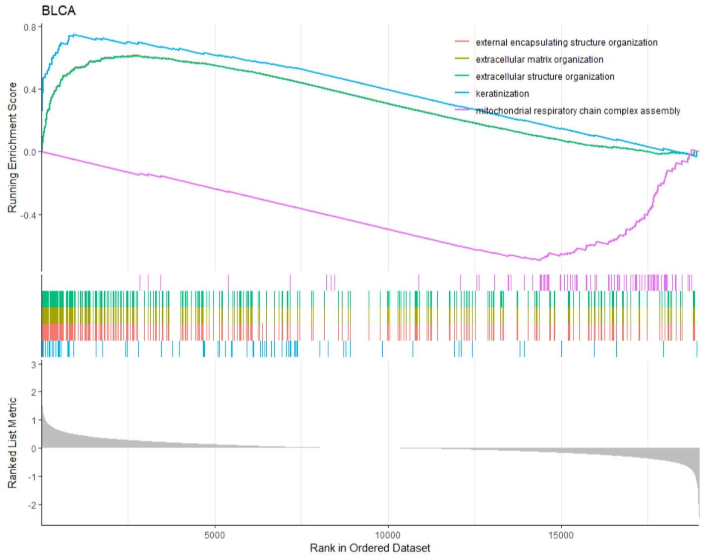

#### 4.1.2.3 GSEA-KEGG grouped by the expression of a spcecific gene

#### `gene_gsea_kegg`

GSEA-KEGG analysis of DEGs grouped by the expression of a single gene in a specific type of cancer, and the top 5 KEGG pathways were shown.


```r
gene_gsea_kegg(cancer,gene,logFC_cutoff=2,pvalue_cutoff = 0.05)
```

### Arguments

**cancer**

cancer name likes "BLCA".

**gene**

gene name likes "KLF7".

**logFC_cutoff** cutoff value of logFC, 2 was the default setting.

**pvalue_cutoff**

cutoff value of pvalue, 0.05 was the default setting.

**Example**


```r
gene_gsea_kegg("BLCA","KLF7")
```
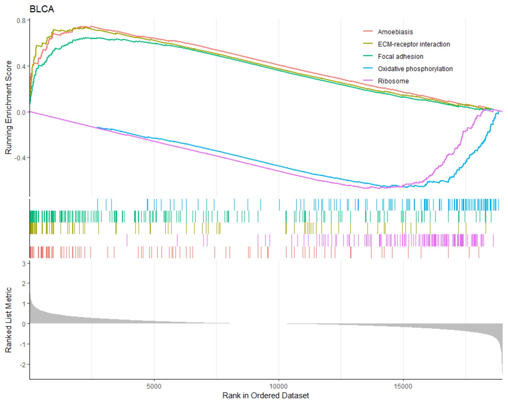

## 4.2 Diagnostic ROC Curve

#### `tcga_roc`

Diagnostic ROC curve of a single gene in a specific type of cancer.


```r
tcga_roc(cancer,gene)
```

### Arguments

**cancer**

cancer name likes "BRCA".

**gene**

gene name likes "KLF7".

**Example**


```r
tcga_roc("BRCA","KLF7")
```
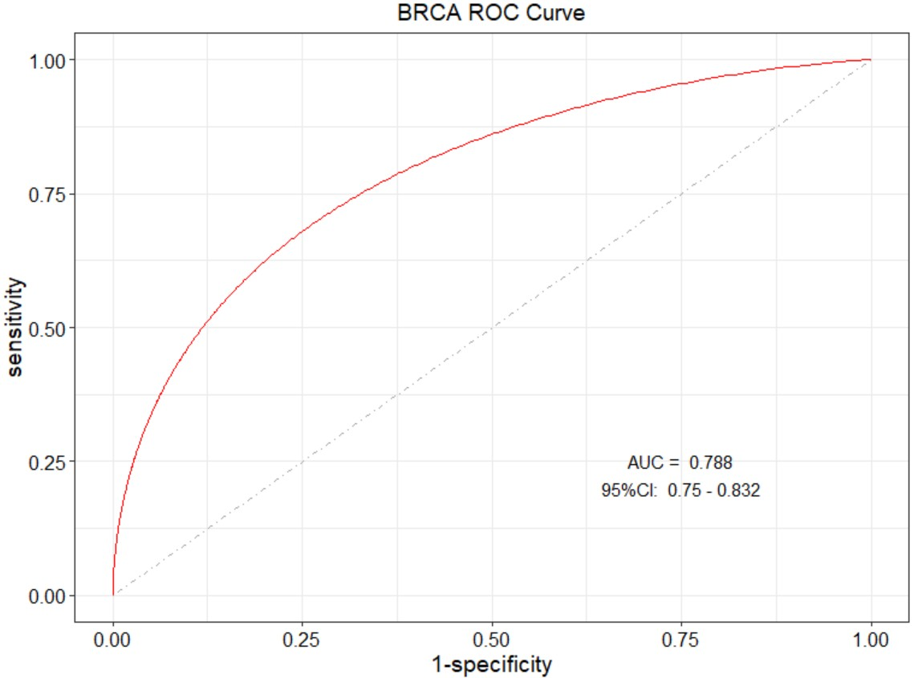

## 4.3 Cancer type specific correlation analysis

### 4.3.1 Gene-gene correlation scatter

#### `gene_gene_scatter`

Scatter plot of gene and gene correlation in a specific type cancer.


```r
gene_gene_scatter(cancer,gene1,gene2,density="F")
```

### Arguments

**cancer**

cancer name likes "BLCA".

**gene1**

name of gene1 likes "CBX2".

**gene2**

name of gene1 likes "CBX3".

**density**

whether density of gene expression was shown.

**Example**


```r
gene_gene_scatter("BLCA","CBX2","CBX3")
gene_gene_scatter("BLCA","CBX2","CBX3",density="T")
```
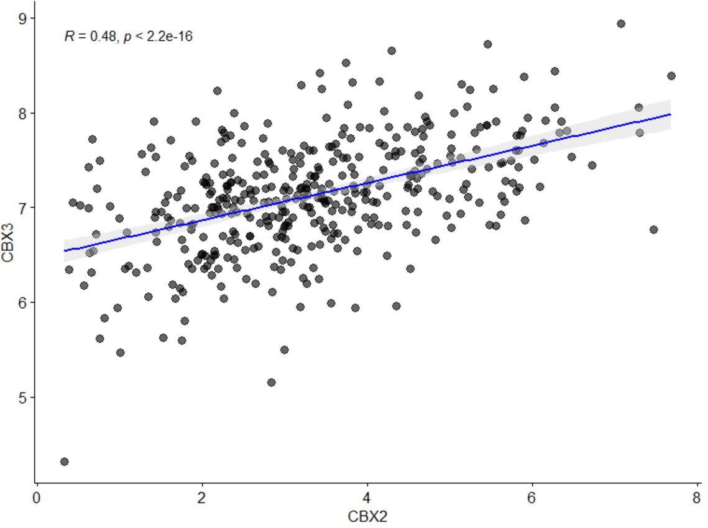


### 4.3.2 Gene-promoter methylation correlation scatter

#### `gene_methylation_scatter`

Scatter plot of gene expression and gene promoter methylation correlation in a specific type of cancer. A pdf file named gene_methylation will be generated in the working directory.


```r
gene_methylation_scatter(cancer,gene)
```

### Arguments

**cancer**

cancer name likes "BLCA".

**gene**

gene name likes "KLF7".

**Example**


```r
gene_methylation_scatter("BLCA","KLF7")
```
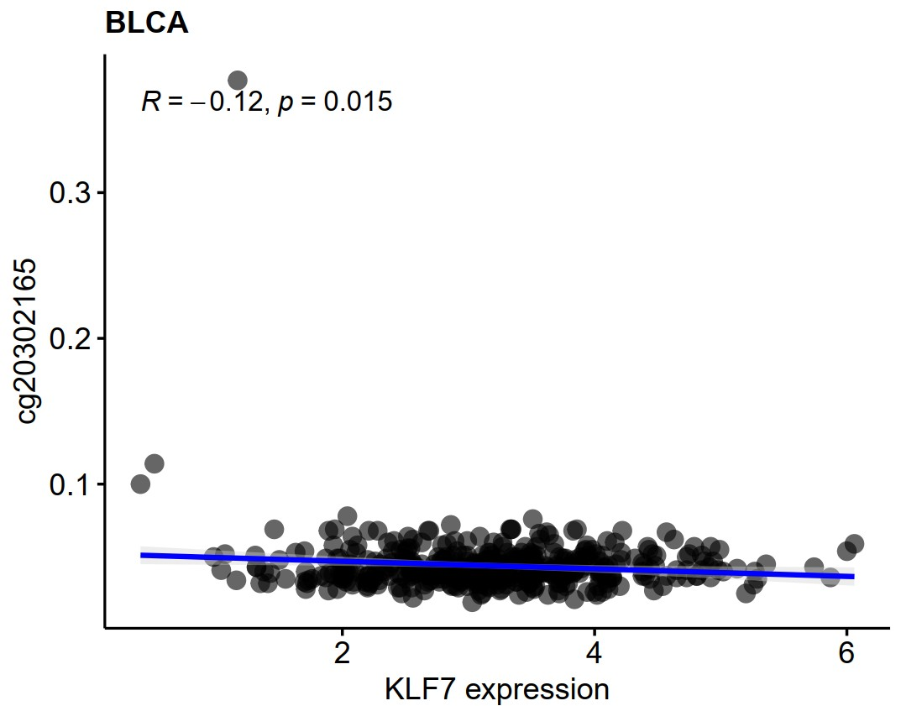

### 4.3.3 Expression heatmap of significantly correlated genes and GO analysis

#### `gene_coexp_heatmap`

Heatmap and Go enrichment of the positive and negative co-expressed genes of a single gene in a specific type of cancer.


```r
gene_coexp_heatmap(cancer,gene,top_n=20, method="pearson")
```

### Arguments

**cancer**

cancer name likes "STAD".

**gene**

gene name likes "KLF7".

**top_n** the number of co-expressed genes.

**method** method="pearson" is the default value. The alternatives to be passed to correlation were "spearman" and "kendall".

**Example**


```r
gene_coexp_heatmap("STAD","KLF7")
```
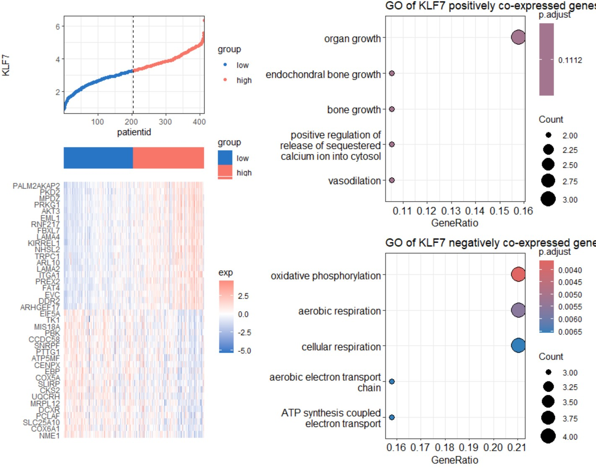

## 4.4 Survavial analysis

### 4.4.1 Survavial analysis based on the expression of a single gene

#### `tcga_kmplot`

K_M survival plot for a single gene in a specific type of cancer.


```r
tcga_kmplot(cancer,gene,palette='jco')
```

### Arguments

**cancer**

cancer name likes "COAD".

**gene**

gene name likes "KLF7".

**palette** the color palette to be used for coloring or filling by groups. Allowed values include scientific journal palettes from ggsci R package, e.g.: "npg", "aaas", "lancet", "jco".

**Example**


```r
tcga_kmplot("COAD","KLF7")
```
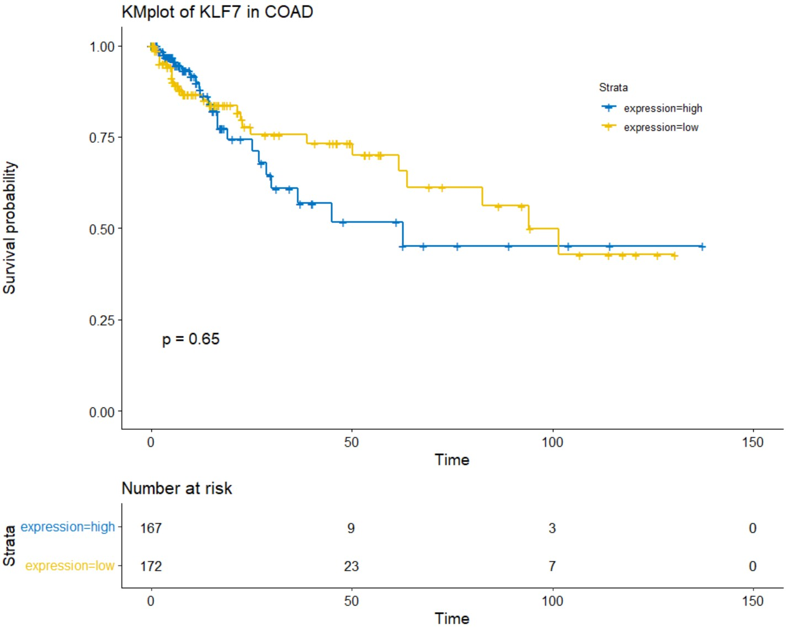

### 4.4.2 Survavial analysis based on the promoter methylation of a spcecific gene

#### `methy_kmplot`

Describes the K_M survival plot based on the promoter methylation of a single gene in a specific type of cancer. A pdf file named methylation_kmplot will be generated in the working directory.


```r
methy_kmplot(cancer,gene,palette='jco')
```

### Arguments

**cancer**

cancer name likes "COAD".

**gene**

gene name likes "KLF7".

**palette** the color palette to be used for coloring or filling by groups. Allowed values include scientific journal palettes from ggsci R package, e.g.: "npg", "aaas", "lancet", "jco".

**Example**


```r
methy_kmplot("COAD","KLF7")
```
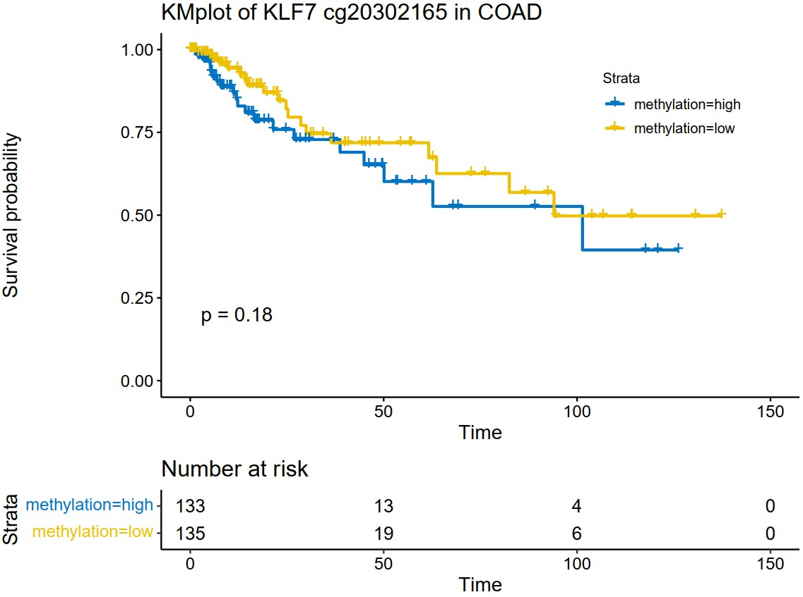

# 5. Built-in data extraction

## 5.1 TPM matrix extraction

#### `get_tpm`

Extract the TPM matrix of a specific type of cancer in TCGA.


```r
get_tpm(cancer)
```

### Arguments

**cancer**

cancer name likes "COAD".

**Example**


```r
get_tpm("COAD")

#>                  Cancer Group TSPAN6 TNMD DPM1 SCYL3 C1orf112  FGR  CFH FUCA2
#> TCGA-CM-4743-01A   COAD Tumor   4.83 0.00 6.54  1.92     1.50 2.72 3.82  6.05
#> TCGA-D5-6931-01A   COAD Tumor   6.58 1.73 6.70  3.26     3.42 3.11 3.97  6.31
#> TCGA-AA-A00A-01A   COAD Tumor   5.93 1.03 6.20  2.90     2.12 2.99 3.24  6.82
#> TCGA-AD-A5EK-01A   COAD Tumor   7.36 0.47 8.03  2.75     2.75 1.51 2.26  6.35
#> TCGA-A6-2680-01A   COAD Tumor   6.90 1.73 6.66  2.55     3.01 2.79 2.88  6.02
```

## 5.2 Paired TPM matrix extraction

#### `get_paired_tpm`

Extract the TPM matrix of a specific type of cancer with paired samples (n\>20) in TCGA.


```r
get_paired_tpm(cancer)
```

### Arguments

**cancer**

cancer name likes "COAD".

**Example**


```r
get_paired_tpm("COAD")

#>                  Cancer Group TSPAN6 TNMD DPM1 SCYL3 C1orf112  FGR  CFH FUCA2
#> TCGA-CM-4743-01A   COAD Tumor   4.83 0.00 6.54  1.92     1.50 2.72 3.82  6.05
#> TCGA-D5-6931-01A   COAD Tumor   6.58 1.73 6.70  3.26     3.42 3.11 3.97  6.31
#> TCGA-AA-A00A-01A   COAD Tumor   5.93 1.03 6.20  2.90     2.12 2.99 3.24  6.82
#> TCGA-AD-A5EK-01A   COAD Tumor   7.36 0.47 8.03  2.75     2.75 1.51 2.26  6.35
#> TCGA-A6-2680-01A   COAD Tumor   6.90 1.73 6.66  2.55     3.01 2.79 2.88  6.02
```

## 5.3 Clinical information extraction

#### `get_meta`

Extract the clinical information of a specific type of cancer in TCGA.


```r
get_meta(cancer)
```

### Arguments

**cancer**

cancer name likes "COAD".

**Example**


```r
get_meta("COAD")

#>              Cancer event   time age gender stage
#> TCGA-3L-AA1B   COAD     0   5.13  61      F     I
#> TCGA-4N-A93T   COAD     0   0.27  67      M   III
#> TCGA-4T-AA8H   COAD     0   5.33  42      F    II
#> TCGA-5M-AAT4   COAD     1   1.63  74      M    IV
#> TCGA-5M-AAT6   COAD     1   9.67  41      F    IV
#> TCGA-5M-AATE   COAD     0  40.00  76      M    II
#> TCGA-A6-2671   COAD     0  21.60  86      M    IV

```

## 5.4 TMB extraction

#### `get_tmb`

Extract the TMB matrix of all samples in TCGA.


```r
get_tmb()
```

**Example**


```r
get_tmb()

#>                     TMB
#> TCGA-OR-A5J1-01A   0.70
#> TCGA-OR-A5J2-01A   0.83
#> TCGA-OR-A5J3-01A   0.27
#> TCGA-OR-A5J5-01A   8.53
#> TCGA-OR-A5J6-01A   0.77
```

## 5.5 MSI extraction

#### `get_msi`

Extract the MSI matrix of all samples in TCGA.


```r
get_msi()
```

**Example**


```r
get_msi()

#>                MSI
#> TCGA-OR-A5J1 0.275
#> TCGA-OR-A5J2 0.324
#> TCGA-OR-A5J3 0.343
#> TCGA-OR-A5J5 0.522
#> TCGA-OR-A5J6 0.289
```

## 5.6 Methylation extraction

#### `get_methy`

Extract the promoter methylation information of all samples in TCGA.


```r
get_methy()
```

**Example**


```r
get_methy()

#> $probe
#>            probe           gene
#> 1     cg26705472         A4GALT
#> 3     cg06339629          AADAT
#> 5     cg14239811          AADAT
```

## 5.7 Immune cell ratio extraction

#### `get_immu_ratio`

Extract the immune cell ratio of all samples in TCGA.


```r
get_immu_ratio()
```

**Example**


```r
get_immu_ratio()

#>                  B cells memory B cells naive Dendritic cells activated
#> TCGA-OR-A5LD-01A         0.0069        0.0000                    0.0000
#> TCGA-OR-A5KO-01A         0.0685        0.0000                    0.0844
#> TCGA-OR-A5LA-01A         0.0000        0.0117                    0.0000
#> TCGA-OR-A5JW-01A         0.0133        0.0000                    0.0258
#> TCGA-PA-A5YG-01A         0.0085        0.0056                    0.0100
#> TCGA-OR-A5JD-01A         0.0146        0.0000                    0.0093

```

## 5.8 Immune score extraction

#### `get_immuscore`

Extract the immune score of all samples in TCGA.


```r
get_immuscore()
```

**Example**


```r
get_immuscore()

#>                  B cells memory B cells naive Dendritic cells activated
#> TCGA-OR-A5LD-01A         0.0069        0.0000                    0.0000
#> TCGA-OR-A5KO-01A         0.0685        0.0000                    0.0844
#> TCGA-OR-A5LA-01A         0.0000        0.0117                    0.0000
#> TCGA-OR-A5JW-01A         0.0133        0.0000                    0.0258
#> TCGA-PA-A5YG-01A         0.0085        0.0056                    0.0100

```

## 5.9 Built-in data summary

#### `get_cancers`

Return the sample summary of 33 types of cancer in TCGA.


```r
get_cancers()
```

**Example**


```r
get_cancers()

#>        Normal Tumor
#>   ACC       0    79
#>   BLCA     19   409
#>   BRCA    113  1113
#>   CESC      3   306
#>   CHOL      9    35
#>   COAD     41   473
#>   DLBC      0    48
#>   ESCA     13   185
```

## 5.10 Built-in data paired sample summary

#### `get_paired_cancers`

Return the sample summary of 15 types of cancer containing more than 20 paired samples in TCGA


```r
get_paired_cancers()
```

**Example**


```r
get_paired_cancers()

#>        Normal Tumor
#>   BLCA     19    19
#>   BRCA    113   113
#>   COAD     41    41
#>   ESCA     13    13
#>   HNSC     43    43
#>   KICH     25    25
```


```r
sessionInfo()
#> R version 4.3.1 (2023-06-16 ucrt)
#> Platform: x86_64-w64-mingw32/x64 (64-bit)
#> Running under: Windows 10 x64 (build 19044)
#> 
#> Matrix products: default
#> 
#> 
#> locale:
#> [1] LC_COLLATE=Chinese (Simplified)_China.utf8  LC_CTYPE=Chinese (Simplified)_China.utf8   
#> [3] LC_MONETARY=Chinese (Simplified)_China.utf8 LC_NUMERIC=C                               
#> [5] LC_TIME=Chinese (Simplified)_China.utf8    
#> 
#> time zone: Asia/Shanghai
#> tzcode source: internal
#> 
#> attached base packages:
#> [1] stats     graphics  grDevices utils     datasets  methods   base     
#> 
#> other attached packages:
#> [1] TCGAplot_0.99.0 testthat_3.2.0  ggpubr_0.6.0    ggplot2_3.4.3  
#> 
#> loaded via a namespace (and not attached):
#>   [1] fs_1.6.3                      matrixStats_1.0.0             bitops_1.0-7                 
#>   [4] enrichplot_1.21.3             devtools_2.4.5                HDO.db_0.99.1                
#>   [7] httr_1.4.7                    RColorBrewer_1.1-3            doParallel_1.0.17            
#>  [10] profvis_0.3.8                 tools_4.3.1                   backports_1.4.1              
#>  [13] utf8_1.2.3                    R6_2.5.1                      lazyeval_0.2.2               
#>  [16] GetoptLong_1.0.5              urlchecker_1.0.1              withr_2.5.1                  
#>  [19] prettyunits_1.2.0             gridExtra_2.3                 cli_3.6.1                    
#>  [22] Biobase_2.61.0                scatterpie_0.2.1              survMisc_0.5.6               
#>  [25] yulab.utils_0.1.0             gson_0.1.0                    DOSE_3.27.2                  
#>  [28] sessioninfo_1.2.2             limma_3.57.9                  rstudioapi_0.15.0            
#>  [31] RSQLite_2.3.1                 generics_0.1.3                gridGraphics_0.5-1           
#>  [34] shape_1.4.6                   car_3.1-2                     dplyr_1.1.3                  
#>  [37] GO.db_3.18.0                  Matrix_1.6-1                  waldo_0.5.1                  
#>  [40] fansi_1.0.4                   S4Vectors_0.39.2              abind_1.4-5                  
#>  [43] lifecycle_1.0.3               whisker_0.4.1                 yaml_2.3.7                   
#>  [46] edgeR_3.99.0                  carData_3.0-5                 qvalue_2.33.0                
#>  [49] BiocFileCache_2.9.1           grid_4.3.1                    blob_1.2.4                   
#>  [52] promises_1.2.1                crayon_1.5.2                  miniUI_0.1.1.1               
#>  [55] lattice_0.21-9                cowplot_1.1.1                 KEGGREST_1.41.4              
#>  [58] pillar_1.9.0                  knitr_1.44                    ComplexHeatmap_2.17.0        
#>  [61] fgsea_1.27.1                  rjson_0.2.21                  codetools_0.2-19             
#>  [64] fastmatch_1.1-4               glue_1.6.2                    ggfun_0.1.3                  
#>  [67] data.table_1.14.8             remotes_2.4.2.1               fmsb_0.7.5                   
#>  [70] vctrs_0.6.3                   png_0.1-8                     treeio_1.25.4                
#>  [73] gtable_0.3.4                  rematch2_2.1.2                cachem_1.0.8                 
#>  [76] xfun_0.40                     mime_0.12                     tidygraph_1.2.3              
#>  [79] survival_3.5-7                diffobj_0.3.5                 pheatmap_1.0.12              
#>  [82] iterators_1.0.14              KMsurv_0.1-5                  statmod_1.5.0                
#>  [85] interactiveDisplayBase_1.39.0 ellipsis_0.3.2                nlme_3.1-163                 
#>  [88] ggtree_3.9.1                  usethis_2.2.2                 bit64_4.0.5                  
#>  [91] filelock_1.0.2                GenomeInfoDb_1.37.6           rprojroot_2.0.3              
#>  [94] colorspace_2.1-0              BiocGenerics_0.47.0           DBI_1.1.3                    
#>  [97] mnormt_2.1.1                  tidyselect_1.2.0              processx_3.8.2               
#> [100] bit_4.0.5                     compiler_4.3.1                curl_5.1.0                   
#> [103] xml2_1.3.5                    desc_1.4.2                    shadowtext_0.1.2             
#> [106] checkmate_2.2.0               scales_1.2.1                  psych_2.3.9                  
#> [109] callr_3.7.3                   rappdirs_0.3.3                stringr_1.5.0                
#> [112] digest_0.6.33                 rmarkdown_2.25                XVector_0.41.1               
#> [115] htmltools_0.5.6               pkgconfig_2.0.3               dbplyr_2.3.4                 
#> [118] fastmap_1.1.1                 rlang_1.1.1                   GlobalOptions_0.1.2          
#> [121] htmlwidgets_1.6.2             shiny_1.7.5                   tinyarray_2.3.1              
#> [124] farver_2.1.1                  zoo_1.8-12                    jsonlite_1.8.7               
#> [127] BiocParallel_1.35.4           GOSemSim_2.27.3               RCurl_1.98-1.12              
#> [130] magrittr_2.0.3                GenomeInfoDbData_1.2.10       ggplotify_0.1.2              
#> [133] patchwork_1.1.3               munsell_0.5.0                 Rcpp_1.0.11                  
#> [136] ape_5.7-1                     viridis_0.6.4                 stringi_1.7.12               
#> [139] pROC_1.18.4                   ggraph_2.1.0                  brio_1.1.3                   
#> [142] zlibbioc_1.47.0               MASS_7.3-60                   AnnotationHub_3.9.2          
#> [145] plyr_1.8.8                    org.Hs.eg.db_3.18.0           pkgbuild_1.4.2               
#> [148] parallel_4.3.1                HPO.db_0.99.2                 ggrepel_0.9.3                
#> [151] survminer_0.4.9               Biostrings_2.69.2             graphlayouts_1.0.1           
#> [154] splines_4.3.1                 circlize_0.4.15               locfit_1.5-9.8               
#> [157] ps_1.7.5                      igraph_1.5.1                  ggsignif_0.6.4               
#> [160] reshape2_1.4.4                stats4_4.3.1                  pkgload_1.3.3                
#> [163] BiocVersion_3.18.0            evaluate_0.22                 BiocManager_1.30.22          
#> [166] foreach_1.5.2                 tweenr_2.0.2                  httpuv_1.6.11                
#> [169] tidyr_1.3.0                   purrr_1.0.2                   polyclip_1.10-6              
#> [172] km.ci_0.5-6                   clue_0.3-65                   ggforce_0.4.1                
#> [175] broom_1.0.5                   xtable_1.8-4                  tidytree_0.4.5               
#> [178] roxygen2_7.2.3                MPO.db_0.99.7                 rstatix_0.7.2                
#> [181] later_1.3.1                   viridisLite_0.4.2             tibble_3.2.1                 
#> [184] clusterProfiler_4.9.4         aplot_0.2.2                   forestplot_3.1.3             
#> [187] memoise_2.0.1                 AnnotationDbi_1.63.2          IRanges_2.35.2               
#> [190] cluster_2.1.4
```
